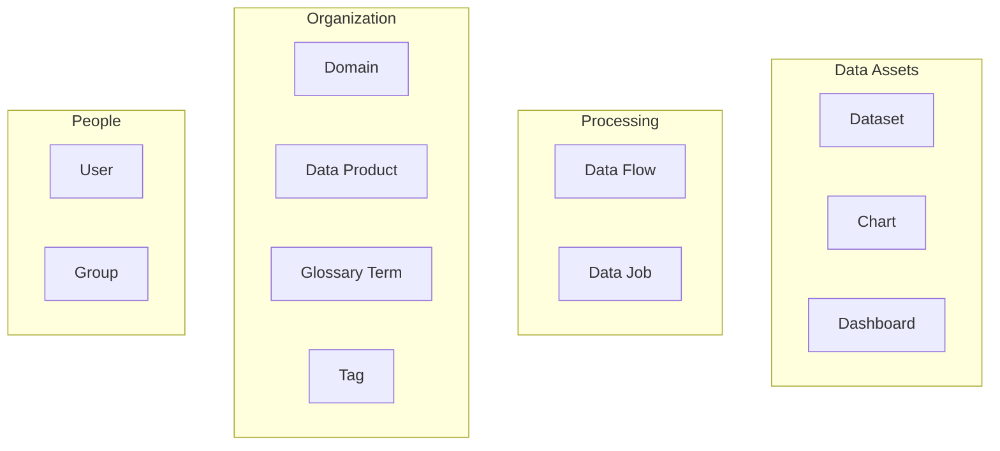
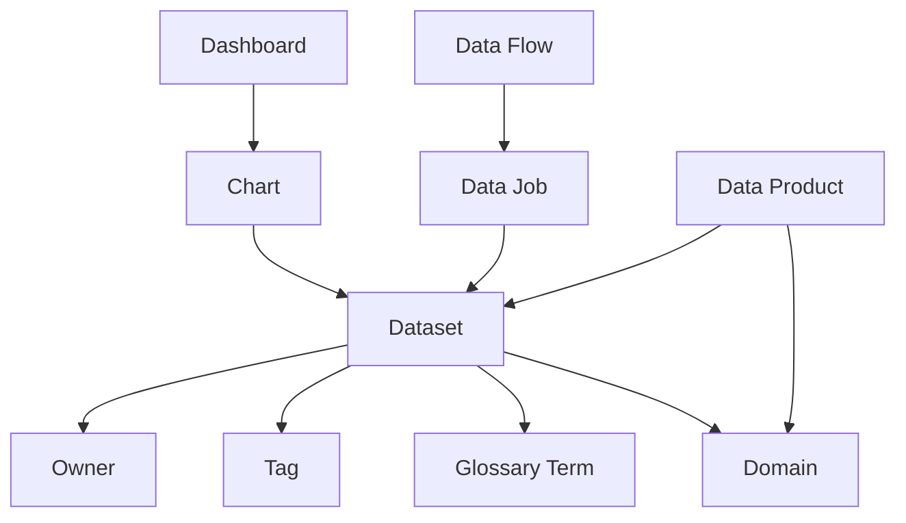

# Entity Types

DataHub organizes metadata into distinct entity types.

## Overview



## Data Assets

### Dataset

Tables, views, files, and other data containers.

**URN Pattern**: `urn:li:dataset:(urn:li:dataPlatform:{platform},{name},{env})`

**Example**:
```
urn:li:dataset:(urn:li:dataPlatform:snowflake,analytics.public.customers,PROD)
```

**Properties**:

| Property | Description |
|----------|-------------|
| `name` | Table/view name |
| `description` | Business description |
| `platform` | Source system (Snowflake, BigQuery, etc.) |
| `schema` | Field definitions |
| `owners` | Data owners |
| `tags` | Classification tags |
| `glossaryTerms` | Business glossary terms |
| `domain` | Organizational domain |

**Sources**: Snowflake, BigQuery, Postgres, MySQL, Redshift, Databricks, S3, Kafka, and more.

### Dashboard

BI dashboards and reports.

**URN Pattern**: `urn:li:dashboard:({platform},{id})`

**Example**:
```
urn:li:dashboard:(looker,sales_overview)
```

**Properties**:

| Property | Description |
|----------|-------------|
| `title` | Dashboard title |
| `description` | Purpose and contents |
| `charts` | Charts included |
| `owners` | Dashboard owners |
| `lastModified` | Last update time |

**Sources**: Looker, Tableau, Power BI, Superset, Metabase.

### Chart

Individual visualizations within dashboards.

**URN Pattern**: `urn:li:chart:({platform},{id})`

**Example**:
```
urn:li:chart:(looker,revenue_by_region)
```

**Properties**:

| Property | Description |
|----------|-------------|
| `title` | Chart title |
| `type` | Visualization type |
| `inputs` | Source datasets |
| `dashboards` | Parent dashboards |

## Processing

### Data Flow

Pipelines and workflows (DAGs).

**URN Pattern**: `urn:li:dataFlow:({orchestrator},{flowId},{cluster})`

**Example**:
```
urn:li:dataFlow:(airflow,etl_customer_pipeline,prod)
```

**Properties**:

| Property | Description |
|----------|-------------|
| `name` | Pipeline name |
| `description` | Pipeline purpose |
| `jobs` | Tasks/jobs within |
| `schedule` | Execution schedule |

**Sources**: Airflow, Prefect, Dagster, dbt, Spark.

### Data Job

Individual tasks within a pipeline.

**URN Pattern**: `urn:li:dataJob:({flow_urn},{job_id})`

**Example**:
```
urn:li:dataJob:(urn:li:dataFlow:(airflow,etl_pipeline,prod),transform_customers)
```

**Properties**:

| Property | Description |
|----------|-------------|
| `name` | Task name |
| `type` | Task type |
| `inputs` | Input datasets |
| `outputs` | Output datasets |

## Organization

### Domain

Organizational groupings for data assets.

**URN Pattern**: `urn:li:domain:{id}`

**Example**:
```
urn:li:domain:sales
```

**Properties**:

| Property | Description |
|----------|-------------|
| `name` | Domain name |
| `description` | Domain purpose |
| `owners` | Domain owners |
| `entities` | Assets in domain |

**Use Cases**:

- Organize by business unit (Sales, Marketing, Finance)
- Organize by function (Analytics, ML, Operations)
- Organize by product line

### Data Product

Curated collections of data assets.

**URN Pattern**: `urn:li:dataProduct:{id}`

**Example**:
```
urn:li:dataProduct:customer-360
```

**Properties**:

| Property | Description |
|----------|-------------|
| `name` | Product name |
| `description` | Product description |
| `assets` | Included datasets |
| `owners` | Product owners |
| `domain` | Parent domain |
| `outputPorts` | Published interfaces |

**Use Cases**:

- Customer 360 view
- Revenue analytics package
- ML feature store

### Glossary Term

Business vocabulary definitions.

**URN Pattern**: `urn:li:glossaryTerm:{path}`

**Example**:
```
urn:li:glossaryTerm:Classification.PII
```

**Properties**:

| Property | Description |
|----------|-------------|
| `name` | Term name |
| `definition` | Term definition |
| `termSource` | Source (INTERNAL, EXTERNAL) |
| `relatedTerms` | Related terms |
| `parentNode` | Parent term/group |

**Use Cases**:

- PII classification
- Business metric definitions
- Industry-specific terminology

### Tag

Simple labels for classification.

**URN Pattern**: `urn:li:tag:{name}`

**Example**:
```
urn:li:tag:deprecated
```

**Common Tags**:

| Tag | Purpose |
|-----|---------|
| `deprecated` | Asset is deprecated |
| `pii` | Contains personal data |
| `sensitive` | Sensitive data |
| `certified` | Quality certified |
| `raw` | Raw/unprocessed data |
| `derived` | Derived/computed data |

## People

### Corp User

Users in the organization.

**URN Pattern**: `urn:li:corpuser:{id}`

**Example**:
```
urn:li:corpuser:john.doe@company.com
```

**Properties**:

| Property | Description |
|----------|-------------|
| `name` | Display name |
| `email` | Email address |
| `title` | Job title |
| `department` | Department |
| `manager` | Manager URN |

### Corp Group

Groups of users.

**URN Pattern**: `urn:li:corpGroup:{name}`

**Example**:
```
urn:li:corpGroup:data-engineering
```

## Entity Relationships



## Searching by Entity Type

Use the `entity_type` parameter to filter searches:

| Type | Filter Value |
|------|--------------|
| Dataset | `DATASET` |
| Dashboard | `DASHBOARD` |
| Chart | `CHART` |
| Data Flow | `DATA_FLOW` |
| Data Job | `DATA_JOB` |
| Glossary Term | `GLOSSARY_TERM` |
| Domain | `DOMAIN` |
| Data Product | `DATA_PRODUCT` |
| Tag | `TAG` |
| User | `CORP_USER` |
| Group | `CORP_GROUP` |

Example:

```
datahub_search query="customer" entity_type="DATASET"
```

## Related Topics

- [Understanding URNs](urns.md): How entities are identified
- [Lineage Model](lineage-model.md): How entities are connected
- [Tools Reference](../server/tools.md): How to query entities
