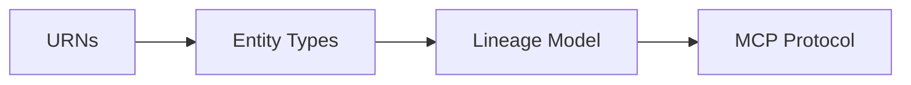

# Concepts

Deep explanations of how things work.

## Core Concepts

| Concept | Description |
|---------|-------------|
| [Understanding URNs](urns.md) | How DataHub identifies entities |
| [Entity Types](entity-types.md) | Datasets, dashboards, pipelines, and more |
| [Lineage Model](lineage-model.md) | How DataHub tracks data flow |
| [MCP Protocol](mcp-protocol.md) | How AI assistants communicate with tools |

## Why These Concepts Matter

Understanding these concepts helps you:

- **Write better queries**: Know what to search for and how
- **Interpret results**: Understand what URNs and entity types mean
- **Debug issues**: Know where to look when things go wrong
- **Extend the system**: Build custom integrations effectively

## Learning Path

1. Start with **URNs** to understand how entities are identified
2. Learn **Entity Types** to know what kinds of data exist
3. Understand **Lineage** to see how data flows
4. Learn **MCP** to understand how AI assistants use tools

## Difference from Tutorials and Guides

| Type | Purpose | Example |
|------|---------|---------|
| **Tutorials** | Learn by doing | "Build your first search" |
| **Guides** | Solve specific problems | "How to add authentication" |
| **Concepts** | Understand why/how | "How URNs work" |
| **Reference** | Look up details | "API parameter list" |

Concepts explain the "why" behind the system design.
