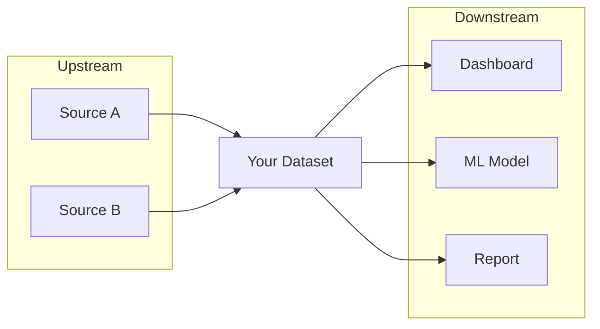
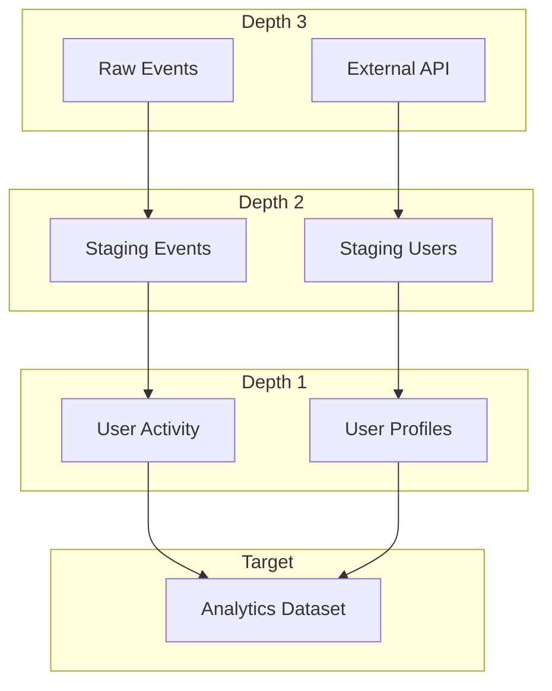
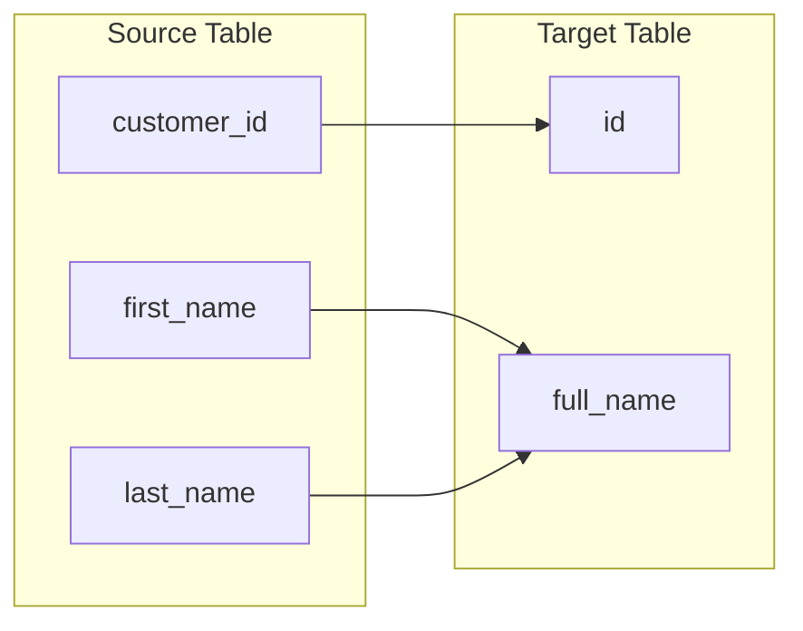
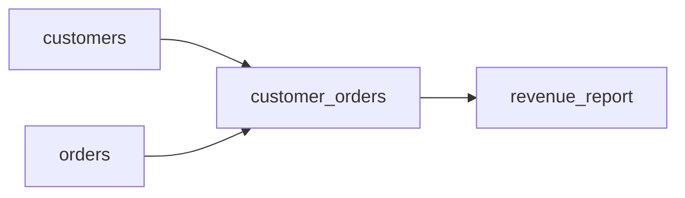
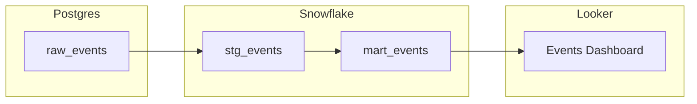
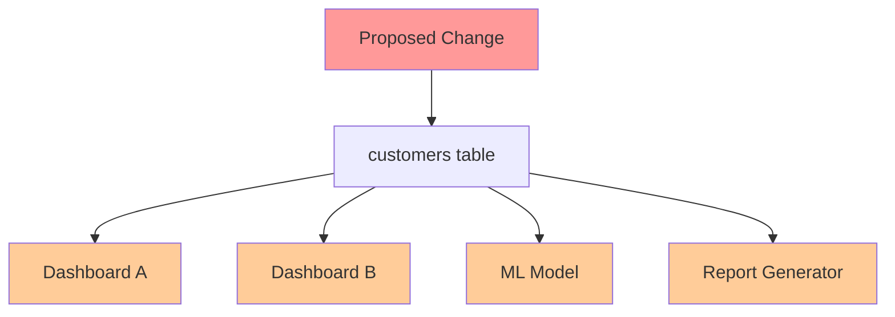
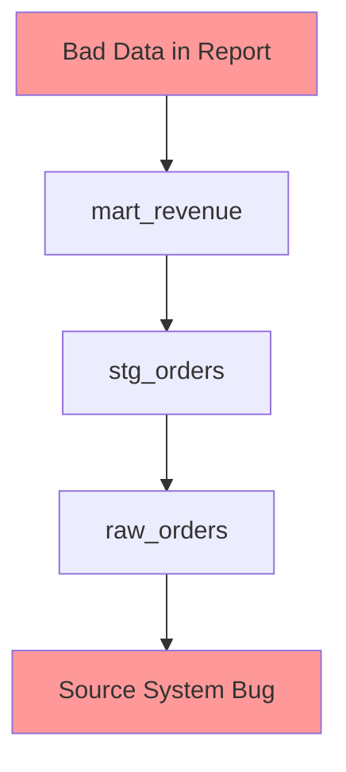
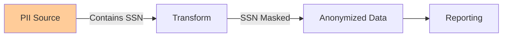

# Lineage Model

How DataHub tracks data flow and dependencies.

## What is Data Lineage?

Data lineage tracks the origin, movement, and transformation of data through systems. It answers:

- Where does this data come from?
- What systems use this data?
- How was this data transformed?
- What is the impact of changing this data?

## Lineage Directions



### Upstream Lineage

Entities that feed data INTO the target entity.

- Raw data sources
- Staging tables
- Parent datasets in transformations

### Downstream Lineage

Entities that consume data FROM the target entity.

- Dashboards and reports
- Derived datasets
- ML models
- Other consumers

## Lineage Depth

Lineage can be traversed to different depths:



| Depth | Description |
|-------|-------------|
| 1 | Direct dependencies only |
| 2 | Two hops away |
| 3 | Three hops away |
| N | N hops away |

Higher depth reveals more context but increases query time.

## Lineage Types

### Column-Level Lineage

Tracks which columns derive from which source columns.



This shows that:

- `id` comes from `customer_id`
- `full_name` is derived from `first_name` and `last_name`

### Table-Level Lineage

Tracks which tables are used to create other tables.



### Cross-Platform Lineage

Tracks data across different systems.



## Lineage Sources

DataHub collects lineage from multiple sources:

| Source | Method |
|--------|--------|
| SQL parsing | Parse CREATE TABLE AS, INSERT INTO |
| dbt | dbt manifest and catalog files |
| Airflow | Task dependencies |
| Spark | Spark lineage events |
| Great Expectations | Validation dependencies |
| Manual | UI or API annotations |

## Querying Lineage

### Table-Level Lineage Query

```
datahub_get_lineage urn="urn:li:dataset:..." direction="BOTH" depth=2
```

### Column-Level Lineage Query

```
datahub_get_column_lineage urn="urn:li:dataset:..."
```

Column-level lineage returns fine-grained mappings:

```json
{
  "dataset_urn": "urn:li:dataset:(platform,db.schema.target,PROD)",
  "mappings": [
    {
      "downstream_column": "id",
      "upstream_dataset": "urn:li:dataset:(platform,db.schema.source,PROD)",
      "upstream_column": "customer_id",
      "transform": "IDENTITY"
    },
    {
      "downstream_column": "full_name",
      "upstream_dataset": "urn:li:dataset:(platform,db.schema.source,PROD)",
      "upstream_column": "first_name",
      "transform": "TRANSFORM",
      "confidence_score": 0.9
    }
  ]
}
```

**Transform Types:**

| Transform | Description |
|-----------|-------------|
| IDENTITY | Column copied directly |
| AGGREGATE | Column derived from aggregation |
| TRANSFORM | Column has been computed or transformed |

### Response Structure

```json
{
  "urn": "urn:li:dataset:(platform,db.schema.target,PROD)",
  "upstream": [
    {
      "urn": "urn:li:dataset:(platform,db.schema.source1,PROD)",
      "name": "source1",
      "type": "DATASET",
      "platform": "snowflake",
      "degree": 1
    },
    {
      "urn": "urn:li:dataset:(platform,db.schema.source2,PROD)",
      "name": "source2",
      "type": "DATASET",
      "platform": "snowflake",
      "degree": 1
    }
  ],
  "downstream": [
    {
      "urn": "urn:li:dashboard:(looker,dashboard_id)",
      "name": "Sales Dashboard",
      "type": "DASHBOARD",
      "platform": "looker",
      "degree": 1
    }
  ]
}
```

### Understanding Degree

The `degree` field indicates distance from the target:

- Degree 1: Direct dependency
- Degree 2: One hop away
- Degree 3: Two hops away

## Use Cases

### Impact Analysis

Before changing a table, understand what depends on it:



Questions to answer:

- What dashboards will break?
- What ML models need retraining?
- What reports need updating?

### Root Cause Analysis

When data quality issues occur, trace back to the source:



### Compliance and Governance

Track sensitive data through the pipeline:



## Lineage Limitations

### Not Always Complete

- Some transformations are opaque (stored procedures)
- Manual data movements are not tracked
- Some platforms do not emit lineage events

### Point-in-Time

- Lineage represents current state
- Historical lineage may not be available
- Schema changes can break lineage

### Performance Considerations

- Deep lineage queries can be slow
- Large lineage graphs consume memory
- Consider caching for repeated queries

## Best Practices

### Start with Depth 1

Begin with direct dependencies, then expand:

```
datahub_get_lineage urn="..." depth=1
```

### Filter by Direction

If you only need upstream or downstream:

```
datahub_get_lineage urn="..." direction="UPSTREAM"
```

### Use for Specific Questions

Instead of fetching everything, query for specific needs:

- Impact analysis: downstream depth 2-3
- Root cause: upstream depth 3-5
- Direct dependencies: depth 1

## Related Topics

- [Tutorial: Exploring Lineage](../tutorials/exploring-lineage.md): Hands-on lineage exploration
- [Entity Types](entity-types.md): What entities have lineage
- [Tools Reference](../server/tools.md): Lineage tool parameters
