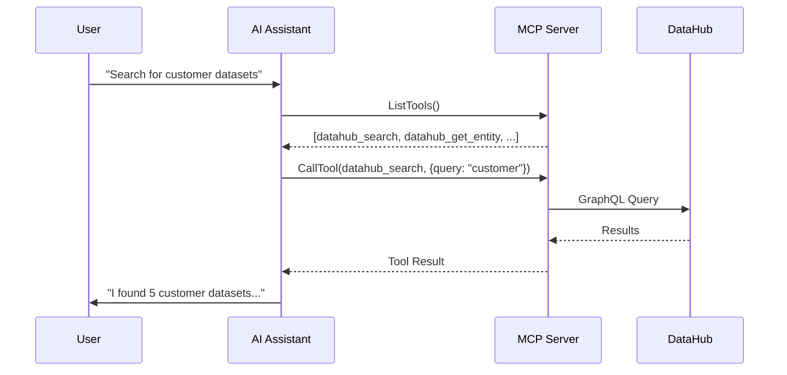
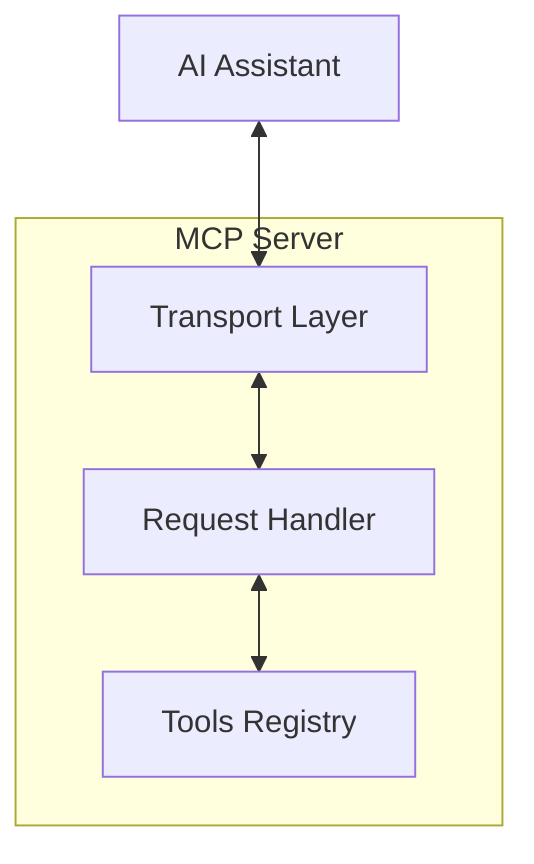
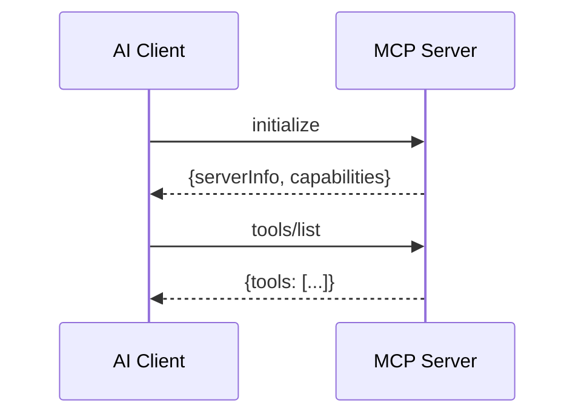
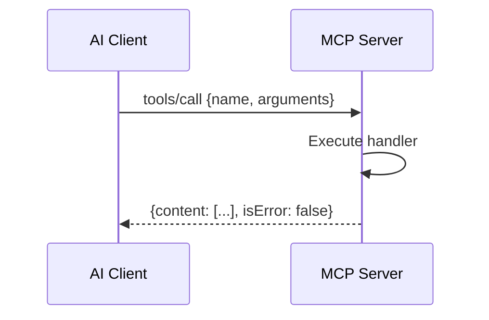
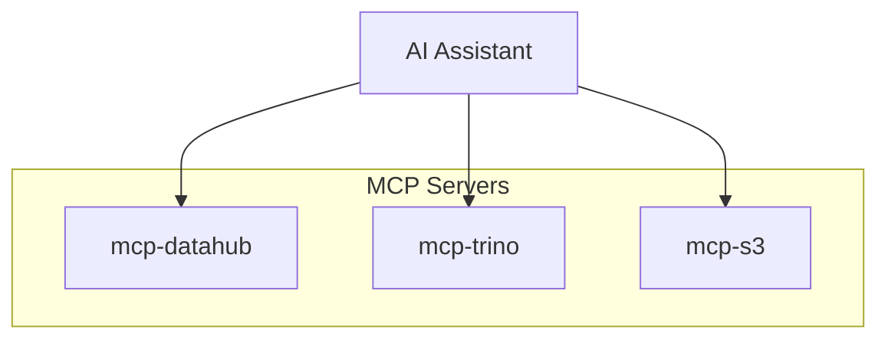

# MCP Protocol

How AI assistants communicate with tools.

## What is MCP?

MCP (Model Context Protocol) is an open standard that enables AI assistants to interact with external tools and data sources. It provides a structured way for AI models to:

- Discover available tools
- Call tools with parameters
- Receive structured results

## How MCP Works



## MCP Components

### Server

The MCP server provides tools to AI assistants. mcp-datahub is an MCP server.



### Tools

Tools are functions that AI assistants can call. Each tool has:

| Property | Description |
|----------|-------------|
| Name | Unique identifier |
| Description | What the tool does |
| Input Schema | Parameters the tool accepts |
| Annotations | Behavior hints (read-only, destructive, idempotent) |
| Handler | Function that executes the tool |

Example tool definition:

```json
{
  "name": "datahub_search",
  "description": "Search for datasets, dashboards, and other assets in DataHub",
  "inputSchema": {
    "type": "object",
    "properties": {
      "query": {
        "type": "string",
        "description": "Search query"
      },
      "entity_type": {
        "type": "string",
        "description": "Filter by entity type"
      },
      "limit": {
        "type": "integer",
        "description": "Maximum results"
      }
    },
    "required": ["query"]
  }
}
```

### Tool Annotations

Tool annotations are optional metadata that describe a tool's behavior to AI clients. mcp-datahub sets annotations on all 19 tools:

| Annotation | Description |
|------------|-------------|
| `ReadOnlyHint` | Tool only reads data (all 12 read tools) |
| `DestructiveHint` | Tool may destructively update (false for all write tools) |
| `IdempotentHint` | Repeated calls produce the same result (all tools) |
| `OpenWorldHint` | Tool interacts with external entities beyond the server (false for all tools) |

MCP clients can use these hints to make informed decisions, such as auto-approving read-only tools or prompting for confirmation before write operations.

### Transport

MCP supports multiple transport mechanisms:

| Transport | Use Case |
|-----------|----------|
| stdio | Local process communication |
| HTTP/SSE | Remote server communication |
| WebSocket | Bidirectional streaming |

mcp-datahub uses stdio transport by default for Claude Desktop integration.

## MCP Message Flow

### Tool Discovery



### Tool Execution



## Why MCP for DataHub?

### Standardized Interface

MCP provides a standard way for any AI assistant to access DataHub:

- Claude (Anthropic)
- ChatGPT (OpenAI)
- Other AI assistants

### Type-Safe Parameters

The input schema ensures AI assistants pass correct parameters:

```json
{
  "query": "customer",
  "entity_type": "DATASET",
  "limit": 10
}
```

### Structured Responses

Tools return structured data that AI can process:

```json
{
  "content": [
    {
      "type": "text",
      "text": "{\"entities\": [...], \"total\": 42}"
    }
  ]
}
```

### Composability

Multiple MCP servers can be combined:



## MCP in mcp-datahub

### Server Creation

```go
server := mcp.NewServer(&mcp.Implementation{
    Name:    "mcp-datahub",
    Version: "0.2.0",
}, nil)
```

### Tool Registration

```go
toolkit := tools.NewToolkit(datahubClient)
toolkit.RegisterAll(server)
```

### Running the Server

```go
transport := &mcp.StdioTransport{}
server.Run(context.Background(), transport)
```

## MCP Clients

### Claude Desktop

Claude Desktop natively supports MCP servers. Configure in `claude_desktop_config.json`:

```json
{
  "mcpServers": {
    "datahub": {
      "command": "mcp-datahub",
      "env": {
        "DATAHUB_URL": "https://datahub.example.com",
        "DATAHUB_TOKEN": "token"
      }
    }
  }
}
```

### Claude Code

Configure with the CLI:

```bash
claude mcp add datahub \
  -e DATAHUB_URL=https://datahub.example.com \
  -e DATAHUB_TOKEN=token \
  -- mcp-datahub
```

### Cursor

Cursor supports MCP through its settings.

### Custom Clients

Build your own MCP client using the SDK:

```go
client := mcp.NewClient(&mcp.Implementation{
    Name:    "my-client",
    Version: "1.0.0",
})

transport := &mcp.StdioTransport{
    Cmd: exec.Command("mcp-datahub"),
}

client.Connect(ctx, transport)

// List tools
tools, _ := client.ListTools(ctx)

// Call a tool
result, _ := client.CallTool(ctx, &mcp.CallToolRequest{
    Name: "datahub_search",
    Arguments: map[string]any{
        "query": "customer",
    },
})
```

## Security Considerations

### Tool Permissions

MCP servers control what tools are available:

```go
// Only register specific tools
toolkit.Register(server,
    tools.ToolSearch,
    tools.ToolGetEntity,
)
// Dangerous tools not registered
```

### Input Validation

Tool handlers validate input:

```go
func searchHandler(ctx context.Context, req *mcp.CallToolRequest) (*mcp.CallToolResult, error) {
    query, ok := req.Arguments["query"].(string)
    if !ok || query == "" {
        return tools.ErrorResult("query is required"), nil
    }
    // ...
}
```

### Authentication

Add authentication via middleware:

```go
toolkit := tools.NewToolkit(client,
    tools.WithMiddleware(authMiddleware),
)
```

## Related Topics

- [Architecture](../library/architecture.md): How mcp-datahub implements MCP
- [Composability](../library/composability.md): Combining MCP servers
- [Tutorial: Building a Server](../tutorials/building-custom-server.md): Create your own MCP server
