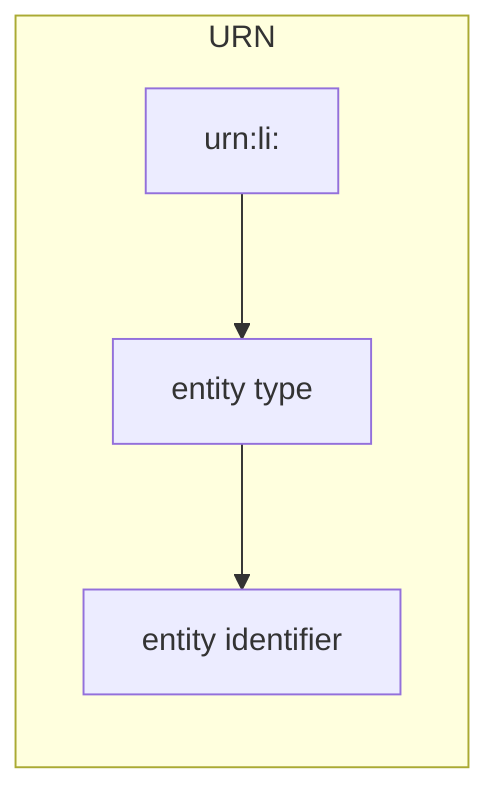

# Understanding URNs

URNs (Uniform Resource Names) are the primary identifiers in DataHub.

## What is a URN?

A URN is a unique identifier for any entity in DataHub. Every dataset, dashboard, user, tag, and glossary term has a URN.

```
urn:li:dataset:(urn:li:dataPlatform:snowflake,mydb.schema.customers,PROD)
```

## URN Structure



A URN consists of:

| Part | Description | Example |
|------|-------------|---------|
| Prefix | Always `urn:li:` | `urn:li:` |
| Entity Type | The kind of entity | `dataset`, `dashboard`, `user` |
| Identifier | Unique ID within type | Platform + name + environment |

## Common URN Patterns

### Dataset URN

```
urn:li:dataset:(urn:li:dataPlatform:snowflake,mydb.schema.table,PROD)
```

Components:

| Part | Value | Description |
|------|-------|-------------|
| Entity type | `dataset` | This is a dataset |
| Platform URN | `urn:li:dataPlatform:snowflake` | Hosted on Snowflake |
| Name | `mydb.schema.table` | Fully qualified table name |
| Fabric | `PROD` | Production environment |

### Dashboard URN

```
urn:li:dashboard:(looker,dashboard_123)
```

Components:

| Part | Value | Description |
|------|-------|-------------|
| Entity type | `dashboard` | This is a dashboard |
| Platform | `looker` | Hosted on Looker |
| ID | `dashboard_123` | Dashboard identifier |

### User URN

```
urn:li:corpuser:john.doe@company.com
```

Components:

| Part | Value | Description |
|------|-------|-------------|
| Entity type | `corpuser` | Corporate user |
| ID | `john.doe@company.com` | User identifier |

### Glossary Term URN

```
urn:li:glossaryTerm:Classification.PII
```

Components:

| Part | Value | Description |
|------|-------|-------------|
| Entity type | `glossaryTerm` | Glossary term |
| Path | `Classification.PII` | Hierarchical path |

### Tag URN

```
urn:li:tag:deprecated
```

### Domain URN

```
urn:li:domain:sales
```

### Data Product URN

```
urn:li:dataProduct:customer-360
```

## Platform URNs

Platform URNs identify data systems:

| Platform | URN |
|----------|-----|
| Snowflake | `urn:li:dataPlatform:snowflake` |
| BigQuery | `urn:li:dataPlatform:bigquery` |
| Postgres | `urn:li:dataPlatform:postgres` |
| MySQL | `urn:li:dataPlatform:mysql` |
| Redshift | `urn:li:dataPlatform:redshift` |
| Databricks | `urn:li:dataPlatform:databricks` |
| Spark | `urn:li:dataPlatform:spark` |
| Kafka | `urn:li:dataPlatform:kafka` |
| S3 | `urn:li:dataPlatform:s3` |
| Looker | `urn:li:dataPlatform:looker` |
| Tableau | `urn:li:dataPlatform:tableau` |
| Airflow | `urn:li:dataPlatform:airflow` |
| dbt | `urn:li:dataPlatform:dbt` |

## Environment/Fabric Values

The fabric indicates the environment:

| Fabric | Description |
|--------|-------------|
| `PROD` | Production |
| `DEV` | Development |
| `TEST` | Testing |
| `QA` | Quality assurance |
| `STAGING` | Staging |

## Parsing URNs

### In Go

```go
// Simple parsing
func parseDatasetURN(urn string) (platform, name, fabric string, err error) {
    // urn:li:dataset:(urn:li:dataPlatform:snowflake,mydb.schema.table,PROD)
    re := regexp.MustCompile(`urn:li:dataset:\(urn:li:dataPlatform:(\w+),([^,]+),(\w+)\)`)
    matches := re.FindStringSubmatch(urn)
    if len(matches) != 4 {
        return "", "", "", errors.New("invalid dataset URN")
    }
    return matches[1], matches[2], matches[3], nil
}
```

### Constructing URNs

```go
func buildDatasetURN(platform, name, fabric string) string {
    return fmt.Sprintf(
        "urn:li:dataset:(urn:li:dataPlatform:%s,%s,%s)",
        platform, name, fabric,
    )
}

// Example
urn := buildDatasetURN("snowflake", "mydb.schema.customers", "PROD")
// Result: urn:li:dataset:(urn:li:dataPlatform:snowflake,mydb.schema.customers,PROD)
```

## URN Best Practices

### Always Use Full URNs

When calling tools, use the complete URN:

```
Good: urn:li:dataset:(urn:li:dataPlatform:snowflake,mydb.schema.customers,PROD)
Bad:  mydb.schema.customers
```

### URNs are Case-Sensitive

```
urn:li:dataset:(urn:li:dataPlatform:snowflake,MyDB.Schema.Table,PROD)
```

Is different from:

```
urn:li:dataset:(urn:li:dataPlatform:snowflake,mydb.schema.table,PROD)
```

### URL-Encode in HTTP Requests

When passing URNs in URLs, encode them:

```
Original: urn:li:dataset:(urn:li:dataPlatform:snowflake,db.schema.table,PROD)
Encoded:  urn%3Ali%3Adataset%3A%28urn%3Ali%3AdataPlatform%3Asnowflake%2Cdb.schema.table%2CPROD%29
```

## Common URN Issues

### Invalid URN Format

```
Error: invalid URN: mydb.schema.table
```

Solution: Use full URN format including `urn:li:` prefix.

### URN Not Found

```
Error: entity not found: urn:li:dataset:...
```

Possible causes:

- Typo in URN
- Wrong environment (PROD vs DEV)
- Entity not yet ingested
- Case sensitivity mismatch

### Platform Mismatch

```
Error: platform mismatch
```

The platform in the URN does not match where the entity is stored.

## Related Topics

- [Entity Types](entity-types.md): What kinds of entities have URNs
- [Tutorial: First Search](../tutorials/first-search.md): Working with URNs in practice
