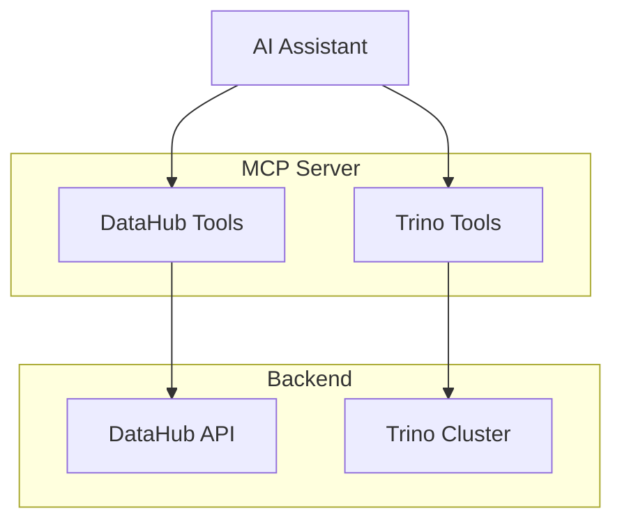

# Example: Combined DataHub + Trino

Unified MCP server with both DataHub metadata and Trino query execution.

## Architecture



## Complete Code

```go
package main

import (
    "context"
    "log"
    "os"

    "github.com/modelcontextprotocol/go-sdk/mcp"

    datahubclient "github.com/txn2/mcp-datahub/pkg/client"
    datahubtools "github.com/txn2/mcp-datahub/pkg/tools"

    trinoclient "github.com/txn2/mcp-trino/pkg/client"
    trinotools "github.com/txn2/mcp-trino/pkg/tools"
)

func main() {
    server := mcp.NewServer(&mcp.Implementation{
        Name:    "unified-data-server",
        Version: "1.0.0",
    }, nil)

    // DataHub client and tools
    dhClient, err := datahubclient.New(datahubclient.Config{
        URL:   os.Getenv("DATAHUB_URL"),
        Token: os.Getenv("DATAHUB_TOKEN"),
    })
    if err != nil {
        log.Fatalf("Failed to create DataHub client: %v", err)
    }
    defer dhClient.Close()

    datahubToolkit := datahubtools.NewToolkit(dhClient, datahubtools.Config{
        DefaultLimit:    20,
        MaxLimit:        100,
        MaxLineageDepth: 5,
    })
    datahubToolkit.RegisterAll(server)

    // Trino client and tools
    trClient, err := trinoclient.New(trinoclient.Config{
        Host:    os.Getenv("TRINO_HOST"),
        Port:    443,
        User:    os.Getenv("TRINO_USER"),
        Catalog: os.Getenv("TRINO_CATALOG"),
        Schema:  os.Getenv("TRINO_SCHEMA"),
    })
    if err != nil {
        log.Fatalf("Failed to create Trino client: %v", err)
    }
    defer trClient.Close()

    trinoToolkit := trinotools.NewToolkit(trClient, trinotools.Config{
        MaxRows:      1000,
        QueryTimeout: 30,
    })
    trinoToolkit.RegisterAll(server)

    log.Println("Starting unified data MCP server...")
    log.Println("DataHub tools: search, get_entity, get_schema, get_lineage, ...")
    log.Println("Trino tools: query, list_catalogs, list_schemas, list_tables, ...")

    if err := server.Run(context.Background(), &mcp.StdioTransport{}); err != nil {
        log.Fatalf("Server error: %v", err)
    }
}
```

## Configuration

```bash
# DataHub
export DATAHUB_URL=https://datahub.example.com
export DATAHUB_TOKEN=datahub_token

# Trino
export TRINO_HOST=trino.example.com
export TRINO_USER=your_username
export TRINO_CATALOG=hive
export TRINO_SCHEMA=default
```

## Use Cases

This combined server enables powerful workflows:

### Discover and Query

```
User: "Find datasets about customers"
AI: Uses datahub_search to find customer datasets

User: "Show me the schema for that first dataset"
AI: Uses datahub_get_schema to get field details

User: "Query the first 10 rows"
AI: Uses trino_query to execute SELECT * FROM ... LIMIT 10
```

### Lineage and Validation

```
User: "What tables feed into the revenue dashboard?"
AI: Uses datahub_get_lineage to find upstream datasets

User: "Check if those tables have data"
AI: Uses trino_query to run COUNT(*) on each table
```

### Schema Exploration

```
User: "List all tables in the analytics schema"
AI: Uses trino_list_tables to enumerate tables

User: "Which of these are documented in DataHub?"
AI: Uses datahub_search to find matching entities
```

## Available Tools

### DataHub Tools

- `datahub_search`
- `datahub_get_entity`
- `datahub_get_schema`
- `datahub_get_lineage`
- `datahub_get_queries`
- `datahub_get_glossary_term`
- `datahub_list_tags`
- `datahub_list_domains`
- `datahub_list_data_products`
- `datahub_get_data_product`
- `datahub_list_connections`

### Trino Tools

- `trino_query`
- `trino_list_catalogs`
- `trino_list_schemas`
- `trino_list_tables`
- `trino_describe_table`
- `trino_list_connections`

## Dependencies

```bash
go get github.com/txn2/mcp-datahub
go get github.com/txn2/mcp-trino
```

## Selective Registration

Register only the tools you need:

```go
// Only metadata exploration tools
datahubToolkit.Register(server,
    datahubtools.ToolSearch,
    datahubtools.ToolGetEntity,
    datahubtools.ToolGetSchema,
)

// Only query execution
trinoToolkit.Register(server,
    trinotools.ToolQuery,
)
```

## Next Steps

- [Enterprise Server](enterprise-server.md): Add auth, audit, and multi-tenant
- [Guide: Authentication](../guides/authentication.md): Secure the server
