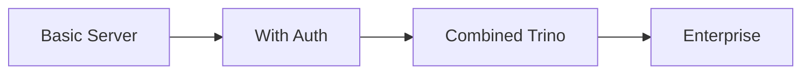

# Code Examples

Complete, runnable code examples for common use cases.

## Available Examples

| Example | Description |
|---------|-------------|
| [Basic Server](basic-server.md) | Minimal MCP server with DataHub tools |
| [With Authentication](with-authentication.md) | Server with JWT authentication |
| [Combined Trino](combined-trino.md) | DataHub + Trino unified server |
| [Enterprise Server](enterprise-server.md) | Full enterprise setup with all features |

## Running Examples

Each example is a complete, runnable Go program. To run:

1. Copy the code to a new directory
2. Initialize a Go module: `go mod init example`
3. Get dependencies: `go mod tidy`
4. Set environment variables
5. Build and run: `go build && ./example`

## Example Structure

Each example follows this pattern:

```go
package main

import (
    // Imports
)

func main() {
    // Create MCP server
    server := mcp.NewServer(...)

    // Create DataHub client
    client, err := client.New(...)

    // Create toolkit with options
    toolkit := tools.NewToolkit(client, ...)

    // Register tools
    toolkit.RegisterAll(server)

    // Run server
    server.Run(ctx, transport)
}
```

## Complexity Progression



Start with the basic server and progressively add features.
