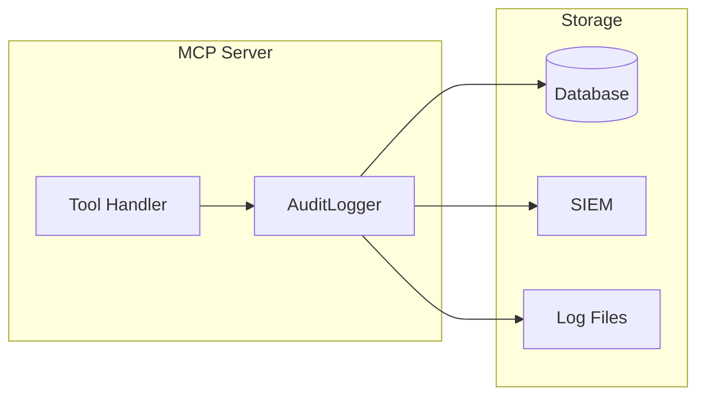

# How to Implement Audit Logging

Add compliance-ready audit logging to your MCP server.

## Goal

Log all tool invocations for security auditing and compliance requirements (SOC2, HIPAA, etc.).

## Prerequisites

- A working custom MCP server
- Authentication middleware that sets user context

## Architecture



## Step 1: Implement AuditLogger Interface

The interface is simple:

```go
type AuditLogger interface {
    LogToolCall(ctx context.Context, tool string, params map[string]any, userID string) error
}
```

## Step 2: Create a Basic Logger

File-based logger for development:

```go
package audit

import (
    "context"
    "encoding/json"
    "os"
    "sync"
    "time"
)

type FileAuditLogger struct {
    file *os.File
    mu   sync.Mutex
}

func NewFileAuditLogger(path string) (*FileAuditLogger, error) {
    f, err := os.OpenFile(path, os.O_APPEND|os.O_CREATE|os.O_WRONLY, 0644)
    if err != nil {
        return nil, err
    }
    return &FileAuditLogger{file: f}, nil
}

func (l *FileAuditLogger) LogToolCall(ctx context.Context, tool string, params map[string]any, userID string) error {
    entry := AuditEntry{
        Timestamp: time.Now().UTC(),
        Tool:      tool,
        UserID:    userID,
        Params:    params,
        RequestID: ctx.Value("request_id"),
        ClientIP:  ctx.Value("client_ip"),
        TenantID:  ctx.Value("tenant_id"),
    }

    l.mu.Lock()
    defer l.mu.Unlock()

    data, err := json.Marshal(entry)
    if err != nil {
        return err
    }

    _, err = l.file.Write(append(data, '\n'))
    return err
}

func (l *FileAuditLogger) Close() error {
    return l.file.Close()
}

type AuditEntry struct {
    Timestamp time.Time      `json:"timestamp"`
    Tool      string         `json:"tool"`
    UserID    string         `json:"user_id"`
    Params    map[string]any `json:"params"`
    RequestID any            `json:"request_id,omitempty"`
    ClientIP  any            `json:"client_ip,omitempty"`
    TenantID  any            `json:"tenant_id,omitempty"`
}
```

## Step 3: Database-Backed Logger

For production compliance:

```go
package audit

import (
    "context"
    "database/sql"
    "encoding/json"
    "time"
)

type DBauditLogger struct {
    db *sql.DB
}

func NewDBauditLogger(db *sql.DB) *DBauditLogger {
    return &DBauditLogger{db: db}
}

func (l *DBauditLogger) LogToolCall(ctx context.Context, tool string, params map[string]any, userID string) error {
    paramsJSON, err := json.Marshal(params)
    if err != nil {
        return err
    }

    _, err = l.db.ExecContext(ctx, `
        INSERT INTO audit_log (
            timestamp,
            tool,
            user_id,
            params,
            request_id,
            client_ip,
            tenant_id
        ) VALUES (?, ?, ?, ?, ?, ?, ?)
    `,
        time.Now().UTC(),
        tool,
        userID,
        paramsJSON,
        ctx.Value("request_id"),
        ctx.Value("client_ip"),
        ctx.Value("tenant_id"),
    )

    return err
}
```

Database schema:

```sql
CREATE TABLE audit_log (
    id BIGINT AUTO_INCREMENT PRIMARY KEY,
    timestamp DATETIME NOT NULL,
    tool VARCHAR(100) NOT NULL,
    user_id VARCHAR(255) NOT NULL,
    params JSON,
    request_id VARCHAR(255),
    client_ip VARCHAR(45),
    tenant_id VARCHAR(255),
    INDEX idx_timestamp (timestamp),
    INDEX idx_user_id (user_id),
    INDEX idx_tenant_id (tenant_id)
);
```

## Step 4: SIEM Integration

Send logs to Splunk, Datadog, or other SIEM:

```go
package audit

import (
    "bytes"
    "context"
    "encoding/json"
    "net/http"
    "time"
)

type SIEMLogger struct {
    endpoint string
    apiKey   string
    client   *http.Client
}

func NewSIEMLogger(endpoint, apiKey string) *SIEMLogger {
    return &SIEMLogger{
        endpoint: endpoint,
        apiKey:   apiKey,
        client:   &http.Client{Timeout: 5 * time.Second},
    }
}

func (l *SIEMLogger) LogToolCall(ctx context.Context, tool string, params map[string]any, userID string) error {
    entry := map[string]any{
        "timestamp":  time.Now().UTC().Format(time.RFC3339),
        "source":     "mcp-datahub",
        "event_type": "tool_call",
        "tool":       tool,
        "user_id":    userID,
        "params":     params,
        "request_id": ctx.Value("request_id"),
        "tenant_id":  ctx.Value("tenant_id"),
    }

    data, err := json.Marshal(entry)
    if err != nil {
        return err
    }

    req, err := http.NewRequestWithContext(ctx, "POST", l.endpoint, bytes.NewReader(data))
    if err != nil {
        return err
    }

    req.Header.Set("Content-Type", "application/json")
    req.Header.Set("Authorization", "Bearer "+l.apiKey)

    resp, err := l.client.Do(req)
    if err != nil {
        return err
    }
    defer resp.Body.Close()

    return nil
}
```

## Step 5: Wire the Logger

```go
// Create user ID extractor
getUserID := func(ctx context.Context) string {
    if id, ok := ctx.Value("user_id").(string); ok {
        return id
    }
    return "anonymous"
}

// Create logger (choose one)
auditLogger, _ := audit.NewFileAuditLogger("/var/log/mcp-audit.jsonl")
// OR
auditLogger := audit.NewDBauditLogger(db)
// OR
auditLogger := audit.NewSIEMLogger(siemEndpoint, siemAPIKey)

// Wire to toolkit
toolkit := tools.NewToolkit(datahubClient,
    tools.WithAuditLogger(auditLogger, getUserID),
)
```

## Step 6: Add Request Context

Enrich logs with request metadata:

```go
type RequestContextMiddleware struct{}

func (m *RequestContextMiddleware) Before(ctx context.Context, tc *tools.ToolContext) (context.Context, error) {
    // Generate request ID
    requestID := uuid.New().String()
    ctx = context.WithValue(ctx, "request_id", requestID)

    // Add timestamp
    ctx = context.WithValue(ctx, "request_time", time.Now().UTC())

    return ctx, nil
}
```

## Compliance Considerations

### SOC2 Requirements

Log these fields:

- Timestamp (UTC)
- User identity
- Action performed
- Resources accessed
- Success/failure status

### HIPAA Requirements

Additional fields:

- Patient data indicators
- Access reason
- Data sensitivity level

### GDPR Requirements

Consider:

- Data retention policies
- Right to erasure
- Anonymization of old logs

## Structured Log Format

Recommended JSON structure:

```json
{
  "timestamp": "2024-01-15T10:30:00.000Z",
  "event_type": "tool_call",
  "tool": "datahub_search",
  "user": {
    "id": "user123",
    "email": "user@example.com",
    "tenant_id": "acme-corp"
  },
  "request": {
    "id": "req-abc123",
    "client_ip": "192.168.1.1"
  },
  "params": {
    "query": "customers",
    "entity_type": "DATASET",
    "limit": 10
  },
  "response": {
    "result_count": 5,
    "duration_ms": 150
  }
}
```

## Verification

Test audit logging:

```go
func TestAuditLogging(t *testing.T) {
    var logged []AuditEntry
    mockLogger := &MockAuditLogger{
        OnLog: func(ctx context.Context, tool string, params map[string]any, userID string) error {
            logged = append(logged, AuditEntry{
                Tool:   tool,
                UserID: userID,
                Params: params,
            })
            return nil
        },
    }

    toolkit := tools.NewToolkit(client,
        tools.WithAuditLogger(mockLogger, func(ctx context.Context) string {
            return "test-user"
        }),
    )

    // Execute a tool
    // ...

    // Verify logging
    if len(logged) != 1 {
        t.Errorf("Expected 1 log entry, got %d", len(logged))
    }
    if logged[0].Tool != "datahub_search" {
        t.Errorf("Expected tool datahub_search, got %s", logged[0].Tool)
    }
}
```

## Troubleshooting

**Logs not appearing**

- Verify logger is wired correctly
- Check file permissions for file logger
- Verify database connection for DB logger

**Missing user information**

- Ensure auth middleware runs before audit logger
- Verify context values are set correctly

**Performance impact**

- Use async logging with buffering
- Consider sampling for high-volume tools

## Next Steps

- [Multi-Tenant Setup](multi-tenant.md): Add tenant context to logs
- [Rate Limiting](rate-limiting.md): Rate limit by user/tenant
