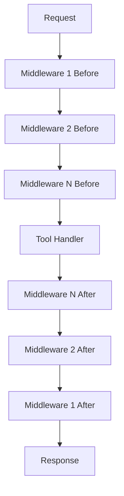

# How to Write Custom Middleware

Create middleware for cross-cutting concerns like logging, metrics, and caching.

## Goal

Implement custom middleware to extend tool behavior without modifying tool handlers.

## Prerequisites

- Understanding of the middleware pattern
- A working custom MCP server

## Middleware Interface

```go
type ToolMiddleware interface {
    Before(ctx context.Context, tc *ToolContext) (context.Context, error)
    After(ctx context.Context, tc *ToolContext, result *mcp.CallToolResult, err error) (*mcp.CallToolResult, error)
}
```

**Before**: Runs before the tool handler. Can modify context or reject the request.

**After**: Runs after the tool handler. Can modify the result or handle errors.

## Execution Flow



Middleware executes in order for Before hooks, and reverse order for After hooks.

## Basic Middleware Examples

### Logging Middleware

```go
type LoggingMiddleware struct {
    logger *log.Logger
}

func (m *LoggingMiddleware) Before(ctx context.Context, tc *tools.ToolContext) (context.Context, error) {
    m.logger.Printf("[START] Tool: %s", tc.Name)
    ctx = context.WithValue(ctx, "start_time", time.Now())
    return ctx, nil
}

func (m *LoggingMiddleware) After(ctx context.Context, tc *tools.ToolContext, result *mcp.CallToolResult, err error) (*mcp.CallToolResult, error) {
    start := ctx.Value("start_time").(time.Time)
    duration := time.Since(start)

    if err != nil {
        m.logger.Printf("[ERROR] Tool: %s, Duration: %v, Error: %v", tc.Name, duration, err)
    } else {
        m.logger.Printf("[SUCCESS] Tool: %s, Duration: %v", tc.Name, duration)
    }

    return result, err
}
```

### Metrics Middleware

```go
type MetricsMiddleware struct {
    requestCounter  *prometheus.CounterVec
    requestDuration *prometheus.HistogramVec
}

func NewMetricsMiddleware() *MetricsMiddleware {
    return &MetricsMiddleware{
        requestCounter: promauto.NewCounterVec(
            prometheus.CounterOpts{
                Name: "mcp_tool_requests_total",
                Help: "Total tool requests",
            },
            []string{"tool", "status"},
        ),
        requestDuration: promauto.NewHistogramVec(
            prometheus.HistogramOpts{
                Name:    "mcp_tool_duration_seconds",
                Help:    "Tool request duration",
                Buckets: prometheus.DefBuckets,
            },
            []string{"tool"},
        ),
    }
}

func (m *MetricsMiddleware) Before(ctx context.Context, tc *tools.ToolContext) (context.Context, error) {
    return context.WithValue(ctx, "metrics_start", time.Now()), nil
}

func (m *MetricsMiddleware) After(ctx context.Context, tc *tools.ToolContext, result *mcp.CallToolResult, err error) (*mcp.CallToolResult, error) {
    start := ctx.Value("metrics_start").(time.Time)
    duration := time.Since(start).Seconds()

    status := "success"
    if err != nil {
        status = "error"
    }

    m.requestCounter.WithLabelValues(tc.Name, status).Inc()
    m.requestDuration.WithLabelValues(tc.Name).Observe(duration)

    return result, err
}
```

### Caching Middleware

```go
type CacheMiddleware struct {
    cache *lru.Cache
    ttl   time.Duration
}

type cacheEntry struct {
    result    *mcp.CallToolResult
    expiresAt time.Time
}

func NewCacheMiddleware(size int, ttl time.Duration) *CacheMiddleware {
    cache, _ := lru.New(size)
    return &CacheMiddleware{cache: cache, ttl: ttl}
}

func (m *CacheMiddleware) Before(ctx context.Context, tc *tools.ToolContext) (context.Context, error) {
    // Only cache read operations
    if !isCacheable(tc.Name) {
        return ctx, nil
    }

    key := m.cacheKey(tc)
    if entry, ok := m.cache.Get(key); ok {
        cached := entry.(cacheEntry)
        if time.Now().Before(cached.expiresAt) {
            // Store cached result for After to return
            ctx = context.WithValue(ctx, "cached_result", cached.result)
        }
    }

    return ctx, nil
}

func (m *CacheMiddleware) After(ctx context.Context, tc *tools.ToolContext, result *mcp.CallToolResult, err error) (*mcp.CallToolResult, error) {
    // Return cached result if available
    if cached, ok := ctx.Value("cached_result").(*mcp.CallToolResult); ok {
        return cached, nil
    }

    // Cache successful results
    if err == nil && isCacheable(tc.Name) {
        key := m.cacheKey(tc)
        m.cache.Add(key, cacheEntry{
            result:    result,
            expiresAt: time.Now().Add(m.ttl),
        })
    }

    return result, err
}

func (m *CacheMiddleware) cacheKey(tc *tools.ToolContext) string {
    // Create deterministic key from tool name and arguments
    data, _ := json.Marshal(tc.Arguments)
    return tc.Name + ":" + string(data)
}

func isCacheable(tool string) bool {
    // Cache read-only operations
    cacheable := map[string]bool{
        "datahub_get_entity":       true,
        "datahub_get_schema":       true,
        "datahub_get_glossary_term": true,
    }
    return cacheable[tool]
}
```

### Error Recovery Middleware

```go
type RecoveryMiddleware struct {
    logger *log.Logger
}

func (m *RecoveryMiddleware) Before(ctx context.Context, tc *tools.ToolContext) (context.Context, error) {
    return ctx, nil
}

func (m *RecoveryMiddleware) After(ctx context.Context, tc *tools.ToolContext, result *mcp.CallToolResult, err error) (*mcp.CallToolResult, error) {
    if err != nil {
        m.logger.Printf("Tool %s failed: %v", tc.Name, err)

        // Return user-friendly error
        return &mcp.CallToolResult{
            Content: []mcp.Content{
                mcp.TextContent{
                    Type: "text",
                    Text: fmt.Sprintf("An error occurred: %s", sanitizeError(err)),
                },
            },
            IsError: true,
        }, nil
    }
    return result, err
}

func sanitizeError(err error) string {
    // Remove sensitive information from error messages
    msg := err.Error()
    msg = strings.ReplaceAll(msg, os.Getenv("DATAHUB_TOKEN"), "[REDACTED]")
    return msg
}
```

## Using Helper Functions

For simple cases, use BeforeFunc and AfterFunc:

```go
// Before-only middleware
loggingMiddleware := tools.BeforeFunc(func(ctx context.Context, tc *tools.ToolContext) (context.Context, error) {
    log.Printf("Tool called: %s", tc.Name)
    return ctx, nil
})

// After-only middleware
timingMiddleware := tools.AfterFunc(func(ctx context.Context, tc *tools.ToolContext, result *mcp.CallToolResult, err error) (*mcp.CallToolResult, error) {
    log.Printf("Tool completed: %s", tc.Name)
    return result, err
})
```

## Composing Middleware

Order matters. Middleware runs in registration order for Before, reverse for After:

```go
toolkit := tools.NewToolkit(datahubClient,
    // First: Recovery (catches all errors)
    tools.WithMiddleware(&RecoveryMiddleware{}),
    // Second: Metrics (measures total time including auth)
    tools.WithMiddleware(NewMetricsMiddleware()),
    // Third: Auth (must pass before cache check)
    tools.WithMiddleware(&AuthMiddleware{}),
    // Fourth: Cache (fastest path for cache hits)
    tools.WithMiddleware(NewCacheMiddleware(1000, 5*time.Minute)),
    // Fifth: Logging (logs actual operations)
    tools.WithMiddleware(&LoggingMiddleware{}),
)
```

Execution order:

```
Before: Recovery -> Metrics -> Auth -> Cache -> Logging -> Handler
After:  Handler -> Logging -> Cache -> Auth -> Metrics -> Recovery
```

## Per-Tool Middleware

Apply middleware to specific tools only:

```go
toolkit := tools.NewToolkit(datahubClient,
    // Global middleware
    tools.WithMiddleware(&LoggingMiddleware{}),

    // Cache only for specific tools
    tools.WithToolMiddleware(tools.ToolGetEntity, NewCacheMiddleware(100, time.Minute)),
    tools.WithToolMiddleware(tools.ToolGetSchema, NewCacheMiddleware(100, time.Minute)),

    // Rate limit search more aggressively
    tools.WithToolMiddleware(tools.ToolSearch, NewRateLimiter(5, 10)),
)
```

## Testing Middleware

```go
func TestLoggingMiddleware(t *testing.T) {
    var buf bytes.Buffer
    logger := log.New(&buf, "", 0)
    middleware := &LoggingMiddleware{logger: logger}

    ctx := context.Background()
    tc := &tools.ToolContext{Name: "datahub_search"}

    // Test Before
    ctx, err := middleware.Before(ctx, tc)
    if err != nil {
        t.Fatalf("Before error: %v", err)
    }

    // Verify start time was set
    if ctx.Value("start_time") == nil {
        t.Error("Expected start_time in context")
    }

    // Test After
    result := &mcp.CallToolResult{}
    _, err = middleware.After(ctx, tc, result, nil)
    if err != nil {
        t.Fatalf("After error: %v", err)
    }

    // Verify logging
    logs := buf.String()
    if !strings.Contains(logs, "datahub_search") {
        t.Error("Expected tool name in logs")
    }
}
```

## Troubleshooting

**Middleware not executing**

- Verify middleware is registered with WithMiddleware
- Check middleware order

**Context values not available**

- Ensure values are set in Before hook
- Use the same key for set and get

**After hook not receiving result**

- Check that Before hook returns nil error
- Verify handler completed successfully

## Next Steps

- [Rate Limiting](rate-limiting.md): Rate limit middleware example
- [Audit Logging](audit-logging.md): Audit middleware example
- [API Reference](../reference/tools-api.md): Full middleware API
