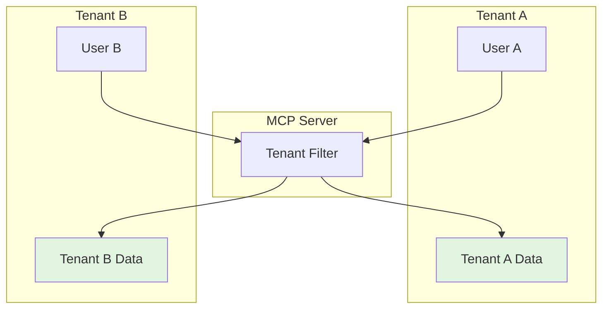

# How to Set Up Multi-Tenant Isolation

Isolate data access by tenant or organization.

## Goal

Ensure users can only access data belonging to their tenant.

## Prerequisites

- A working custom MCP server with authentication
- Tenant information available in user context

## Architecture



## Step 1: Define Tenant Context

Add tenant information to the request context:

```go
// In your auth middleware
func (m *AuthMiddleware) Before(ctx context.Context, tc *tools.ToolContext) (context.Context, error) {
    // ... validate token ...

    // Extract tenant from token claims
    tenantID := claims["tenant_id"].(string)
    ctx = context.WithValue(ctx, "tenant_id", tenantID)

    return ctx, nil
}
```

## Step 2: Implement Tenant Access Filter

Create an AccessFilter that enforces tenant boundaries:

```go
package tenant

import (
    "context"
    "errors"
    "strings"

    "github.com/txn2/mcp-datahub/pkg/integration"
)

type TenantAccessFilter struct {
    // Map tenant ID to allowed domain prefixes
    tenantDomains map[string][]string
}

func NewTenantAccessFilter(config map[string][]string) *TenantAccessFilter {
    return &TenantAccessFilter{tenantDomains: config}
}

func (f *TenantAccessFilter) CanAccess(ctx context.Context, urn string) (bool, error) {
    tenantID, ok := ctx.Value("tenant_id").(string)
    if !ok || tenantID == "" {
        return false, errors.New("tenant context required")
    }

    // Get allowed domains for this tenant
    allowedDomains := f.tenantDomains[tenantID]
    if len(allowedDomains) == 0 {
        return false, nil // No access if no domains configured
    }

    // Check if URN belongs to an allowed domain
    for _, domain := range allowedDomains {
        if strings.Contains(urn, domain) {
            return true, nil
        }
    }

    return false, nil
}

func (f *TenantAccessFilter) FilterURNs(ctx context.Context, urns []string) ([]string, error) {
    var allowed []string
    for _, urn := range urns {
        ok, err := f.CanAccess(ctx, urn)
        if err != nil {
            return nil, err
        }
        if ok {
            allowed = append(allowed, urn)
        }
    }
    return allowed, nil
}
```

## Step 3: Configure Tenant Mappings

Define which domains each tenant can access:

```go
// Configuration
tenantConfig := map[string][]string{
    "acme-corp": {
        "acme",
        "shared",
    },
    "globex": {
        "globex",
        "shared",
    },
    "initech": {
        "initech",
        "shared",
    },
}

tenantFilter := tenant.NewTenantAccessFilter(tenantConfig)
```

## Step 4: Wire the Filter

Add the tenant filter to your toolkit:

```go
toolkit := tools.NewToolkit(datahubClient,
    tools.WithMiddleware(authMiddleware),
    tools.WithAccessFilter(tenantFilter),
)
```

## Advanced: Database-Backed Tenant Configuration

For dynamic tenant configuration:

```go
type DBTenantAccessFilter struct {
    db *sql.DB
}

func (f *DBTenantAccessFilter) CanAccess(ctx context.Context, urn string) (bool, error) {
    tenantID := ctx.Value("tenant_id").(string)

    // Query allowed patterns for this tenant
    rows, err := f.db.QueryContext(ctx, `
        SELECT urn_pattern FROM tenant_access
        WHERE tenant_id = ?
    `, tenantID)
    if err != nil {
        return false, err
    }
    defer rows.Close()

    for rows.Next() {
        var pattern string
        if err := rows.Scan(&pattern); err != nil {
            return false, err
        }
        if matchesPattern(urn, pattern) {
            return true, nil
        }
    }

    return false, nil
}

func matchesPattern(urn, pattern string) bool {
    // Support wildcards: "urn:li:dataset:*acme*"
    if strings.Contains(pattern, "*") {
        pattern = strings.ReplaceAll(pattern, "*", ".*")
        matched, _ := regexp.MatchString(pattern, urn)
        return matched
    }
    return strings.Contains(urn, pattern)
}
```

## Advanced: Per-Tenant DataHub Connections

For complete isolation, connect each tenant to a separate DataHub:

```go
type TenantClientManager struct {
    clients map[string]*client.Client
}

func (m *TenantClientManager) GetClient(tenantID string) (*client.Client, error) {
    c, ok := m.clients[tenantID]
    if !ok {
        return nil, errors.New("unknown tenant")
    }
    return c, nil
}

// Create middleware that switches clients per tenant
type TenantClientMiddleware struct {
    manager *TenantClientManager
}

func (m *TenantClientMiddleware) Before(ctx context.Context, tc *tools.ToolContext) (context.Context, error) {
    tenantID := ctx.Value("tenant_id").(string)
    client, err := m.manager.GetClient(tenantID)
    if err != nil {
        return ctx, err
    }
    ctx = context.WithValue(ctx, "datahub_client", client)
    return ctx, nil
}
```

## Verification

Test tenant isolation:

```go
func TestTenantIsolation(t *testing.T) {
    filter := tenant.NewTenantAccessFilter(map[string][]string{
        "tenant-a": {"domain-a"},
        "tenant-b": {"domain-b"},
    })

    // Tenant A accessing their data
    ctxA := context.WithValue(context.Background(), "tenant_id", "tenant-a")
    ok, _ := filter.CanAccess(ctxA, "urn:li:dataset:domain-a.table")
    if !ok {
        t.Error("Tenant A should access domain-a")
    }

    // Tenant A accessing Tenant B data
    ok, _ = filter.CanAccess(ctxA, "urn:li:dataset:domain-b.table")
    if ok {
        t.Error("Tenant A should NOT access domain-b")
    }

    // Tenant B accessing their data
    ctxB := context.WithValue(context.Background(), "tenant_id", "tenant-b")
    ok, _ = filter.CanAccess(ctxB, "urn:li:dataset:domain-b.table")
    if !ok {
        t.Error("Tenant B should access domain-b")
    }
}
```

## Troubleshooting

**Users see no results**

- Verify tenant ID is being set in context
- Check tenant configuration includes correct domains
- Verify URNs contain expected domain patterns

**Cross-tenant data leakage**

- Audit FilterURNs implementation
- Ensure filter runs on all tool results
- Check for bypasses in custom tools

**Performance issues**

- Cache tenant configurations
- Use batch permission checks
- Index tenant access patterns in database

## Next Steps

- [Audit Logging](audit-logging.md): Log tenant-scoped access
- [Authentication](authentication.md): Extract tenant from tokens
