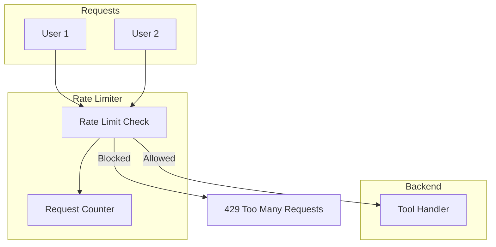

# How to Implement Rate Limiting

Control request rates to protect your DataHub server.

## Goal

Prevent abuse and ensure fair resource allocation by limiting request rates.

## Prerequisites

- A working custom MCP server
- Optional: Redis for distributed rate limiting

## Architecture



## Step 1: In-Memory Rate Limiter

Simple token bucket implementation:

```go
package ratelimit

import (
    "context"
    "errors"
    "sync"
    "time"

    "github.com/modelcontextprotocol/go-sdk/mcp"
    "github.com/txn2/mcp-datahub/pkg/tools"
)

type InMemoryLimiter struct {
    buckets  map[string]*tokenBucket
    mu       sync.RWMutex
    rate     float64       // tokens per second
    capacity int           // max tokens
    cleanup  time.Duration // cleanup interval
}

type tokenBucket struct {
    tokens    float64
    lastCheck time.Time
}

func NewInMemoryLimiter(ratePerSecond float64, capacity int) *InMemoryLimiter {
    l := &InMemoryLimiter{
        buckets:  make(map[string]*tokenBucket),
        rate:     ratePerSecond,
        capacity: capacity,
        cleanup:  5 * time.Minute,
    }
    go l.cleanupLoop()
    return l
}

func (l *InMemoryLimiter) Before(ctx context.Context, tc *tools.ToolContext) (context.Context, error) {
    key := l.getKey(ctx)
    if !l.allow(key) {
        return ctx, errors.New("rate limit exceeded")
    }
    return ctx, nil
}

func (l *InMemoryLimiter) After(ctx context.Context, tc *tools.ToolContext, result *mcp.CallToolResult, err error) (*mcp.CallToolResult, error) {
    return result, err
}

func (l *InMemoryLimiter) getKey(ctx context.Context) string {
    // Rate limit by user
    if userID, ok := ctx.Value("user_id").(string); ok {
        return "user:" + userID
    }
    // Fallback to tenant
    if tenantID, ok := ctx.Value("tenant_id").(string); ok {
        return "tenant:" + tenantID
    }
    return "global"
}

func (l *InMemoryLimiter) allow(key string) bool {
    l.mu.Lock()
    defer l.mu.Unlock()

    now := time.Now()
    bucket, exists := l.buckets[key]

    if !exists {
        l.buckets[key] = &tokenBucket{
            tokens:    float64(l.capacity) - 1,
            lastCheck: now,
        }
        return true
    }

    // Add tokens based on elapsed time
    elapsed := now.Sub(bucket.lastCheck).Seconds()
    bucket.tokens += elapsed * l.rate
    if bucket.tokens > float64(l.capacity) {
        bucket.tokens = float64(l.capacity)
    }
    bucket.lastCheck = now

    // Check if we have tokens
    if bucket.tokens < 1 {
        return false
    }

    bucket.tokens--
    return true
}

func (l *InMemoryLimiter) cleanupLoop() {
    ticker := time.NewTicker(l.cleanup)
    for range ticker.C {
        l.mu.Lock()
        cutoff := time.Now().Add(-l.cleanup)
        for key, bucket := range l.buckets {
            if bucket.lastCheck.Before(cutoff) {
                delete(l.buckets, key)
            }
        }
        l.mu.Unlock()
    }
}
```

## Step 2: Redis Rate Limiter

For distributed deployments:

```go
package ratelimit

import (
    "context"
    "errors"
    "time"

    "github.com/redis/go-redis/v9"
    "github.com/txn2/mcp-datahub/pkg/tools"
)

type RedisLimiter struct {
    client   *redis.Client
    rate     int           // requests per window
    window   time.Duration // time window
    keyPrefix string
}

func NewRedisLimiter(client *redis.Client, rate int, window time.Duration) *RedisLimiter {
    return &RedisLimiter{
        client:    client,
        rate:      rate,
        window:    window,
        keyPrefix: "ratelimit:",
    }
}

func (l *RedisLimiter) Before(ctx context.Context, tc *tools.ToolContext) (context.Context, error) {
    key := l.keyPrefix + l.getKey(ctx)

    // Use sliding window counter
    now := time.Now().UnixMilli()
    windowStart := now - l.window.Milliseconds()

    pipe := l.client.Pipeline()

    // Remove old entries
    pipe.ZRemRangeByScore(ctx, key, "0", fmt.Sprintf("%d", windowStart))

    // Count current window
    countCmd := pipe.ZCard(ctx, key)

    // Add current request
    pipe.ZAdd(ctx, key, redis.Z{Score: float64(now), Member: now})

    // Set expiry
    pipe.Expire(ctx, key, l.window)

    _, err := pipe.Exec(ctx)
    if err != nil {
        return ctx, err
    }

    count := countCmd.Val()
    if count >= int64(l.rate) {
        return ctx, errors.New("rate limit exceeded")
    }

    return ctx, nil
}

func (l *RedisLimiter) getKey(ctx context.Context) string {
    if userID, ok := ctx.Value("user_id").(string); ok {
        return "user:" + userID
    }
    return "global"
}
```

## Step 3: Per-Tool Rate Limits

Apply different limits to different tools:

```go
type PerToolLimiter struct {
    limiters map[tools.ToolName]*InMemoryLimiter
    default_ *InMemoryLimiter
}

func NewPerToolLimiter() *PerToolLimiter {
    return &PerToolLimiter{
        limiters: map[tools.ToolName]*InMemoryLimiter{
            // Heavy operations get stricter limits
            tools.ToolGetLineage: NewInMemoryLimiter(0.5, 5),   // 0.5/sec, burst 5
            tools.ToolSearch:     NewInMemoryLimiter(2, 10),    // 2/sec, burst 10
        },
        default_: NewInMemoryLimiter(5, 20), // 5/sec, burst 20
    }
}

func (l *PerToolLimiter) Before(ctx context.Context, tc *tools.ToolContext) (context.Context, error) {
    limiter, ok := l.limiters[tools.ToolName(tc.Name)]
    if !ok {
        limiter = l.default_
    }
    return limiter.Before(ctx, tc)
}
```

Wire per-tool limits:

```go
toolkit := tools.NewToolkit(datahubClient,
    tools.WithMiddleware(NewPerToolLimiter()),
)
```

## Step 4: Tier-Based Rate Limits

Different limits for different user tiers:

```go
type TieredLimiter struct {
    tiers map[string]*InMemoryLimiter
}

func NewTieredLimiter() *TieredLimiter {
    return &TieredLimiter{
        tiers: map[string]*InMemoryLimiter{
            "free":       NewInMemoryLimiter(1, 5),    // 1/sec, burst 5
            "pro":        NewInMemoryLimiter(5, 20),   // 5/sec, burst 20
            "enterprise": NewInMemoryLimiter(20, 100), // 20/sec, burst 100
        },
    }
}

func (l *TieredLimiter) Before(ctx context.Context, tc *tools.ToolContext) (context.Context, error) {
    tier := "free"
    if t, ok := ctx.Value("user_tier").(string); ok {
        tier = t
    }

    limiter, ok := l.tiers[tier]
    if !ok {
        limiter = l.tiers["free"]
    }

    return limiter.Before(ctx, tc)
}
```

## Step 5: Wire the Limiter

```go
// Choose your limiter
limiter := ratelimit.NewInMemoryLimiter(10, 50) // 10/sec, burst 50
// OR
limiter := ratelimit.NewRedisLimiter(redisClient, 100, time.Minute) // 100/min

toolkit := tools.NewToolkit(datahubClient,
    tools.WithMiddleware(limiter),
)
```

## Configuration Options

| Parameter | Description | Recommended |
|-----------|-------------|-------------|
| Rate | Requests per second | 5-10 for normal use |
| Burst/Capacity | Maximum burst size | 2-5x rate |
| Window | Time window for counting | 1 minute |
| Key | What to rate limit by | User ID or Tenant ID |

## Verification

Test rate limiting:

```go
func TestRateLimiting(t *testing.T) {
    limiter := ratelimit.NewInMemoryLimiter(2, 3) // 2/sec, burst 3

    ctx := context.WithValue(context.Background(), "user_id", "test")
    tc := &tools.ToolContext{Name: "datahub_search"}

    // First 3 requests should succeed (burst)
    for i := 0; i < 3; i++ {
        _, err := limiter.Before(ctx, tc)
        if err != nil {
            t.Errorf("Request %d should succeed: %v", i+1, err)
        }
    }

    // 4th request should fail
    _, err := limiter.Before(ctx, tc)
    if err == nil {
        t.Error("Request 4 should be rate limited")
    }

    // Wait for token refill
    time.Sleep(time.Second)

    // Should succeed again
    _, err = limiter.Before(ctx, tc)
    if err != nil {
        t.Error("Request after wait should succeed")
    }
}
```

## Troubleshooting

**Rate limits too aggressive**

- Increase rate and burst capacity
- Consider per-tool limits for heavy operations

**Rate limits not working**

- Verify middleware is registered
- Check that user context is being set

**Memory growth with in-memory limiter**

- Ensure cleanup loop is running
- Reduce cleanup interval if needed

## Next Steps

- [Authentication](authentication.md): Add user context for per-user limits
- [Multi-Tenant Setup](multi-tenant.md): Per-tenant rate limits
