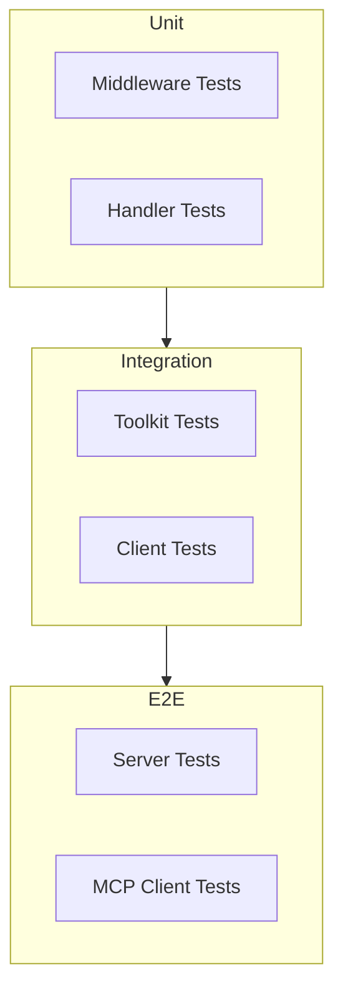

# How to Test Your MCP Server

Test your custom MCP server implementation.

## Goal

Ensure your MCP server works correctly through unit tests, integration tests, and end-to-end tests.

## Prerequisites

- A custom MCP server implementation
- Go testing knowledge

## Testing Levels



## Unit Testing Middleware

Test middleware in isolation:

```go
package middleware_test

import (
    "context"
    "testing"

    "github.com/modelcontextprotocol/go-sdk/mcp"
    "github.com/txn2/mcp-datahub/pkg/tools"
    "your-project/middleware"
)

func TestAuthMiddleware_ValidToken(t *testing.T) {
    m := middleware.NewAuthMiddleware("secret")

    ctx := context.WithValue(context.Background(), "auth_token", "valid-token")
    tc := &tools.ToolContext{Name: "datahub_search"}

    newCtx, err := m.Before(ctx, tc)
    if err != nil {
        t.Fatalf("Expected no error, got: %v", err)
    }

    userID := newCtx.Value("user_id")
    if userID == nil {
        t.Error("Expected user_id in context")
    }
}

func TestAuthMiddleware_MissingToken(t *testing.T) {
    m := middleware.NewAuthMiddleware("secret")

    ctx := context.Background()
    tc := &tools.ToolContext{Name: "datahub_search"}

    _, err := m.Before(ctx, tc)
    if err == nil {
        t.Error("Expected error for missing token")
    }
}

func TestAuthMiddleware_InvalidToken(t *testing.T) {
    m := middleware.NewAuthMiddleware("secret")

    ctx := context.WithValue(context.Background(), "auth_token", "invalid")
    tc := &tools.ToolContext{Name: "datahub_search"}

    _, err := m.Before(ctx, tc)
    if err == nil {
        t.Error("Expected error for invalid token")
    }
}
```

## Unit Testing Access Filters

```go
func TestAccessFilter_CanAccess(t *testing.T) {
    filter := NewTenantAccessFilter(map[string][]string{
        "tenant-a": {"domain-a"},
        "tenant-b": {"domain-b"},
    })

    tests := []struct {
        name     string
        tenantID string
        urn      string
        want     bool
    }{
        {
            name:     "tenant can access own domain",
            tenantID: "tenant-a",
            urn:      "urn:li:dataset:domain-a.table",
            want:     true,
        },
        {
            name:     "tenant cannot access other domain",
            tenantID: "tenant-a",
            urn:      "urn:li:dataset:domain-b.table",
            want:     false,
        },
        {
            name:     "unknown tenant has no access",
            tenantID: "unknown",
            urn:      "urn:li:dataset:domain-a.table",
            want:     false,
        },
    }

    for _, tt := range tests {
        t.Run(tt.name, func(t *testing.T) {
            ctx := context.WithValue(context.Background(), "tenant_id", tt.tenantID)
            got, err := filter.CanAccess(ctx, tt.urn)
            if err != nil {
                t.Fatalf("Unexpected error: %v", err)
            }
            if got != tt.want {
                t.Errorf("CanAccess() = %v, want %v", got, tt.want)
            }
        })
    }
}
```

## Integration Testing with Mock Client

Create a mock DataHub client:

```go
package mock

import (
    "context"

    "github.com/txn2/mcp-datahub/pkg/client"
    "github.com/txn2/mcp-datahub/pkg/types"
)

type MockClient struct {
    SearchFunc     func(ctx context.Context, query string, opts ...client.SearchOption) (*types.SearchResult, error)
    GetEntityFunc  func(ctx context.Context, urn string) (*types.Entity, error)
    GetSchemaFunc  func(ctx context.Context, urn string) (*types.SchemaMetadata, error)
    GetLineageFunc func(ctx context.Context, urn string, opts ...client.LineageOption) (*types.LineageResult, error)
}

func (m *MockClient) Search(ctx context.Context, query string, opts ...client.SearchOption) (*types.SearchResult, error) {
    if m.SearchFunc != nil {
        return m.SearchFunc(ctx, query, opts...)
    }
    return &types.SearchResult{}, nil
}

func (m *MockClient) GetEntity(ctx context.Context, urn string) (*types.Entity, error) {
    if m.GetEntityFunc != nil {
        return m.GetEntityFunc(ctx, urn)
    }
    return &types.Entity{URN: urn}, nil
}

// Implement other methods...
```

Test toolkit with mock:

```go
func TestToolkit_Search(t *testing.T) {
    mockClient := &mock.MockClient{
        SearchFunc: func(ctx context.Context, query string, opts ...client.SearchOption) (*types.SearchResult, error) {
            return &types.SearchResult{
                Entities: []types.Entity{
                    {URN: "urn:li:dataset:test", Name: "test"},
                },
                Total: 1,
            }, nil
        },
    }

    toolkit := tools.NewToolkit(mockClient)

    // Create test server
    server := mcp.NewServer(&mcp.Implementation{
        Name: "test", Version: "1.0.0",
    }, nil)
    toolkit.RegisterAll(server)

    // Call tool directly
    result, err := server.CallTool(context.Background(), &mcp.CallToolRequest{
        Name: "datahub_search",
        Arguments: map[string]any{
            "query": "test",
        },
    })

    if err != nil {
        t.Fatalf("Unexpected error: %v", err)
    }

    // Verify result
    if result.IsError {
        t.Error("Expected success result")
    }
}
```

## Integration Testing with Test Server

Test against a real DataHub test instance:

```go
func TestIntegration_Search(t *testing.T) {
    if testing.Short() {
        t.Skip("Skipping integration test")
    }

    url := os.Getenv("TEST_DATAHUB_URL")
    token := os.Getenv("TEST_DATAHUB_TOKEN")
    if url == "" || token == "" {
        t.Skip("TEST_DATAHUB_URL and TEST_DATAHUB_TOKEN required")
    }

    client, err := client.New(client.Config{
        URL:   url,
        Token: token,
    })
    if err != nil {
        t.Fatalf("Failed to create client: %v", err)
    }
    defer client.Close()

    result, err := client.Search(context.Background(), "*")
    if err != nil {
        t.Fatalf("Search failed: %v", err)
    }

    if result.Total == 0 {
        t.Log("Warning: No entities found in test DataHub")
    }
}
```

## End-to-End Testing

Test the full server with MCP protocol:

```go
func TestE2E_Server(t *testing.T) {
    if testing.Short() {
        t.Skip("Skipping E2E test")
    }

    // Start server in background
    ctx, cancel := context.WithCancel(context.Background())
    defer cancel()

    // Create pipes for stdio
    serverIn, clientOut := io.Pipe()
    clientIn, serverOut := io.Pipe()

    // Start server
    go func() {
        server := createTestServer()
        transport := &mcp.StdioTransport{
            In:  serverIn,
            Out: serverOut,
        }
        server.Run(ctx, transport)
    }()

    // Create client
    client := mcp.NewClient(&mcp.Implementation{
        Name: "test-client", Version: "1.0.0",
    })
    transport := &mcp.StdioTransport{
        In:  clientIn,
        Out: clientOut,
    }

    // Initialize
    err := client.Connect(ctx, transport)
    if err != nil {
        t.Fatalf("Failed to connect: %v", err)
    }

    // List tools
    toolsResult, err := client.ListTools(ctx)
    if err != nil {
        t.Fatalf("Failed to list tools: %v", err)
    }

    if len(toolsResult.Tools) == 0 {
        t.Error("Expected tools to be registered")
    }

    // Call a tool
    result, err := client.CallTool(ctx, &mcp.CallToolRequest{
        Name: "datahub_list_connections",
    })
    if err != nil {
        t.Fatalf("Failed to call tool: %v", err)
    }

    if result.IsError {
        t.Errorf("Tool returned error: %v", result)
    }
}
```

## Table-Driven Tests

Use table-driven tests for comprehensive coverage:

```go
func TestAccessFilter_FilterURNs(t *testing.T) {
    filter := NewAccessFilter(config)

    tests := []struct {
        name     string
        tenantID string
        input    []string
        want     []string
    }{
        {
            name:     "filter to allowed only",
            tenantID: "tenant-a",
            input:    []string{"urn:domain-a:1", "urn:domain-b:1", "urn:domain-a:2"},
            want:     []string{"urn:domain-a:1", "urn:domain-a:2"},
        },
        {
            name:     "empty input",
            tenantID: "tenant-a",
            input:    []string{},
            want:     []string{},
        },
        {
            name:     "all filtered",
            tenantID: "tenant-a",
            input:    []string{"urn:domain-b:1", "urn:domain-c:1"},
            want:     []string{},
        },
    }

    for _, tt := range tests {
        t.Run(tt.name, func(t *testing.T) {
            ctx := context.WithValue(context.Background(), "tenant_id", tt.tenantID)
            got, err := filter.FilterURNs(ctx, tt.input)
            if err != nil {
                t.Fatalf("Unexpected error: %v", err)
            }
            if !reflect.DeepEqual(got, tt.want) {
                t.Errorf("FilterURNs() = %v, want %v", got, tt.want)
            }
        })
    }
}
```

## Test Coverage

Run tests with coverage:

```bash
go test -coverprofile=coverage.out ./...
go tool cover -html=coverage.out -o coverage.html
```

Aim for:

- 80%+ coverage on middleware
- 80%+ coverage on access filters
- Integration tests for critical paths

## CI/CD Pipeline

Example GitHub Actions workflow:

```yaml
name: Test

on: [push, pull_request]

jobs:
  test:
    runs-on: ubuntu-latest
    steps:
      - uses: actions/checkout@v4

      - uses: actions/setup-go@v5
        with:
          go-version: '1.24'

      - name: Unit Tests
        run: go test -race -coverprofile=coverage.out ./...

      - name: Integration Tests
        if: github.event_name == 'push'
        env:
          TEST_DATAHUB_URL: ${{ secrets.TEST_DATAHUB_URL }}
          TEST_DATAHUB_TOKEN: ${{ secrets.TEST_DATAHUB_TOKEN }}
        run: go test -race -tags=integration ./...

      - name: Upload Coverage
        uses: codecov/codecov-action@v4
        with:
          file: coverage.out
```

## Troubleshooting

**Tests pass locally but fail in CI**

- Check environment variable availability
- Verify network access to test services
- Check for race conditions with `-race`

**Mock not being called**

- Verify mock is passed to the right component
- Check function field name matches

**Integration tests flaky**

- Add retries for network operations
- Increase timeouts
- Check for test data dependencies

## Next Steps

- [Custom Middleware](custom-middleware.md): Middleware to test
- [API Reference](../reference/tools-api.md): Interfaces to test against
