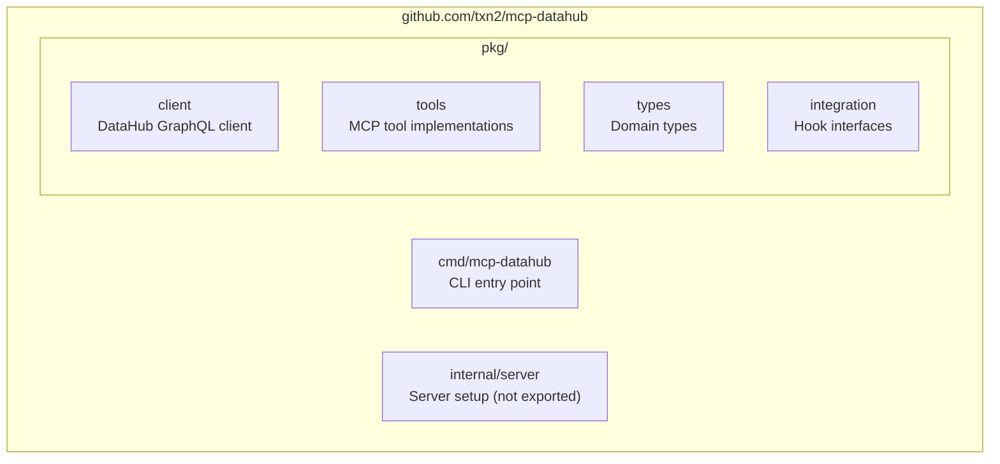
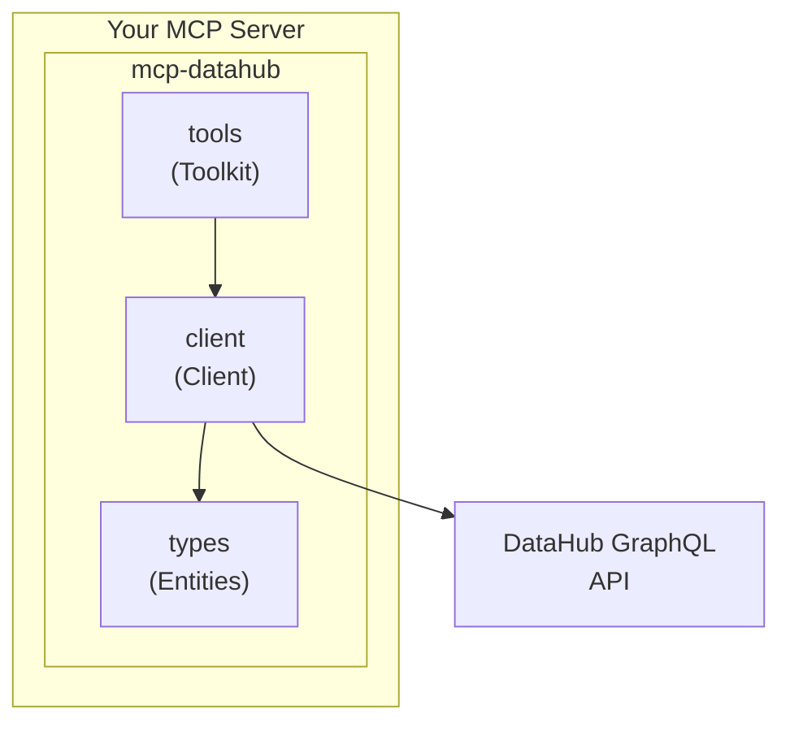

# Architecture

## Design Philosophy

mcp-datahub follows these core principles:

1. **Standalone First**: Works as a complete MCP server out of the box
2. **Library Second**: Import into custom servers for composition
3. **Island Architecture**: No dependencies on other txn2 libraries
4. **Direct API Integration**: Calls DataHub GraphQL API directly
5. **Domain Types Stay Local**: All types defined within this library

## Package Structure



## Component Diagram



## Tools Only Design

This library exposes MCP **Tools** only. It does not expose Resources or Prompts.

**Rationale:**

- **Tools** are the natural fit for DataHub operations (search, get, list)
- **Resources** imply static content; DataHub content is dynamic and query-driven
- **Prompts** are use-case specific; add them in your custom MCP servers

## Integration Hooks

The library provides interfaces for extending functionality:

```go
// URNResolver resolves external IDs to DataHub URNs
type URNResolver interface {
    ResolveToDataHubURN(ctx context.Context, externalID string) (string, error)
}

// AccessFilter controls entity access
type AccessFilter interface {
    CanAccess(ctx context.Context, urn string) (bool, error)
    FilterURNs(ctx context.Context, urns []string) ([]string, error)
}

// AuditLogger logs tool invocations
type AuditLogger interface {
    LogToolCall(ctx context.Context, tool string, params map[string]any, userID string) error
}
```
