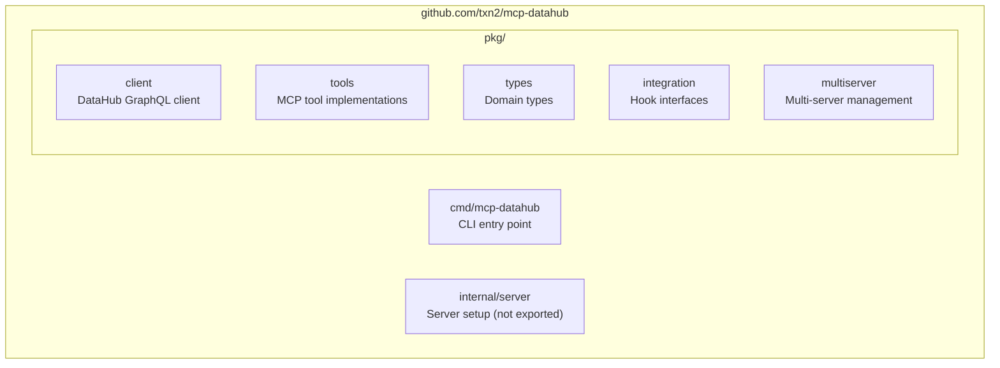
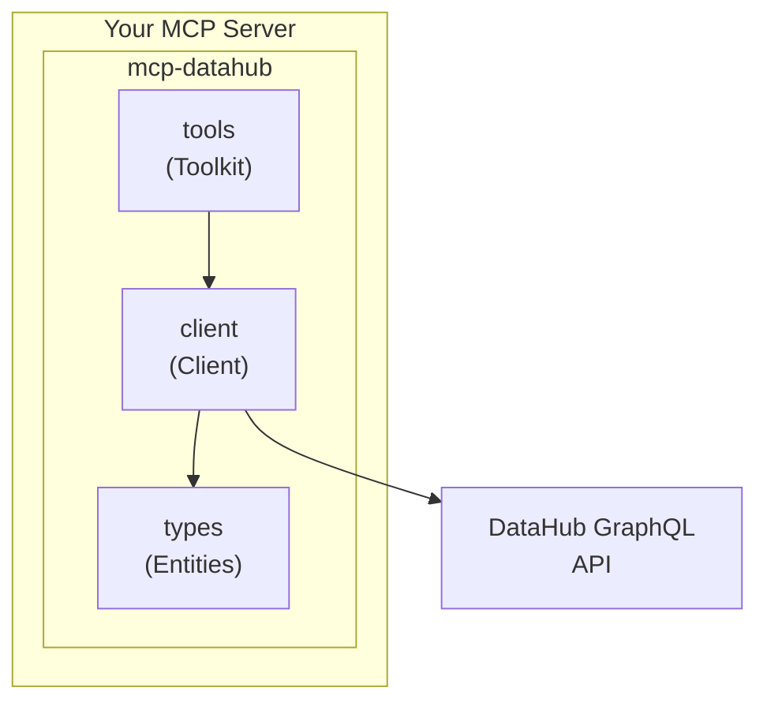
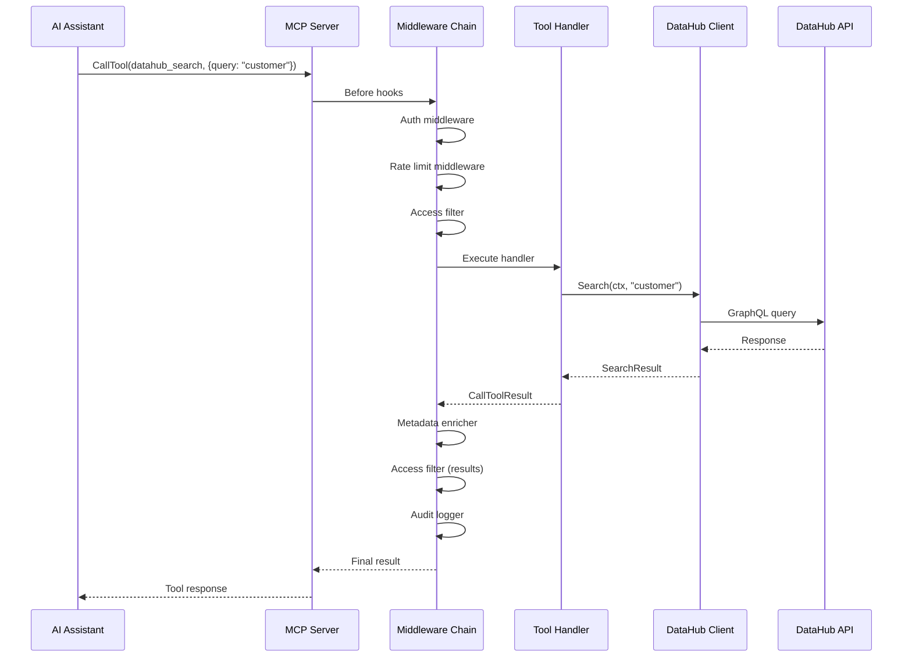
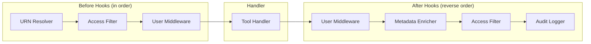
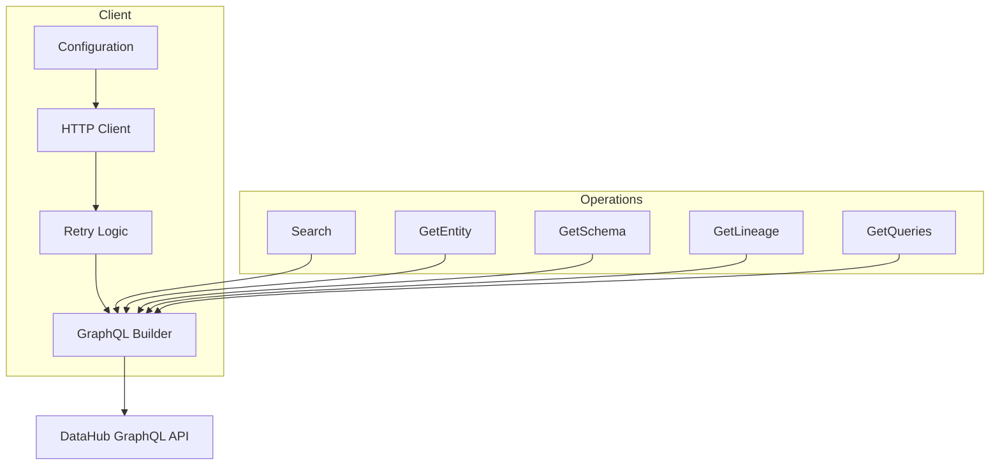
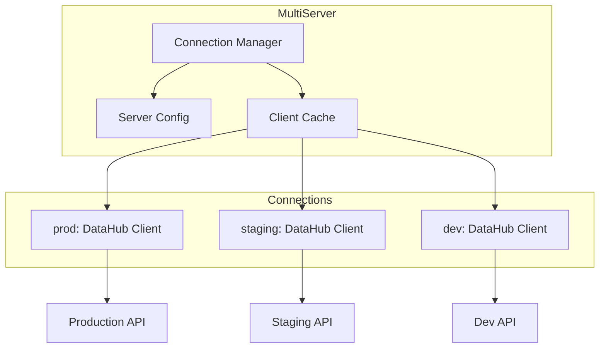
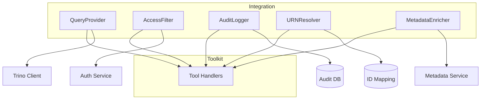
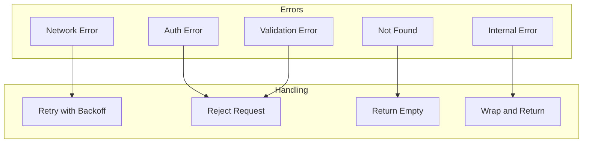

# Architecture

## Design Philosophy

mcp-datahub follows these core principles:

1. **Standalone First**: Works as a complete MCP server out of the box
2. **Library Second**: Import into custom servers for composition
3. **Island Architecture**: No dependencies on other txn2 libraries
4. **Direct API Integration**: Calls DataHub GraphQL API directly
5. **Domain Types Stay Local**: All types defined within this library

## Package Structure



## Component Diagram



## Request Lifecycle

When a tool is called, the request flows through multiple layers:



## Middleware Chain

Middleware wraps tool handlers to add cross-cutting concerns:



**Execution Order:**

1. URN Resolver (Before): Translate external IDs to DataHub URNs
2. Access Filter (Before): Check if user can access the entity
3. User Middleware (Before): Custom pre-processing
4. **Tool Handler**: Execute the actual tool logic
5. User Middleware (After): Custom post-processing
6. Metadata Enricher (After): Add custom metadata to response
7. Access Filter (After): Filter results by access
8. Audit Logger (After): Log the tool invocation

## Tools Only Design

This library exposes MCP **Tools** only. It does not expose Resources or Prompts.

**Rationale:**

- **Tools** are the natural fit for DataHub operations (search, get, list)
- **Resources** imply static content; DataHub content is dynamic and query-driven
- **Prompts** are use-case specific; add them in your custom MCP servers

## Client Architecture

The DataHub client handles all communication with the DataHub GraphQL API:



**Client Features:**

| Feature | Description |
|---------|-------------|
| Connection pooling | Reuses HTTP connections |
| Automatic retries | Retries failed requests with backoff |
| Timeout handling | Configurable request timeouts |
| Error wrapping | Wraps errors with context |
| Version compatibility | Handles DataHub version differences |

## Multi-Server Architecture

The multi-server component manages connections to multiple DataHub instances:



## Integration Points

The library provides extension points for enterprise features:



## Error Handling Strategy

Errors are handled consistently across the library:



**Error Policies:**

| Error Type | Policy | Retries |
|------------|--------|---------|
| Network timeout | Retry with backoff | Up to 3 |
| 401 Unauthorized | Reject immediately | None |
| 404 Not Found | Return empty result | None |
| 400 Bad Request | Reject with details | None |
| 500 Server Error | Retry with backoff | Up to 3 |

## Caching Strategy

The library does not implement caching by default. This is intentional:

- DataHub data changes frequently
- Cache invalidation is complex
- Different use cases need different caching strategies

To add caching, use middleware:

```go
toolkit := tools.NewToolkit(client,
    tools.WithToolMiddleware(tools.ToolGetEntity, cacheMiddleware),
    tools.WithToolMiddleware(tools.ToolGetSchema, cacheMiddleware),
)
```

## Thread Safety

All components are thread-safe:

- Client uses connection pooling with proper synchronization
- Toolkit can handle concurrent tool calls
- Middleware must be stateless or properly synchronized

## Integration Hooks

The library provides interfaces for extending functionality:

```go
// URNResolver resolves external IDs to DataHub URNs
type URNResolver interface {
    ResolveToDataHubURN(ctx context.Context, externalID string) (string, error)
}

// AccessFilter controls entity access
type AccessFilter interface {
    CanAccess(ctx context.Context, urn string) (bool, error)
    FilterURNs(ctx context.Context, urns []string) ([]string, error)
}

// AuditLogger logs tool invocations
type AuditLogger interface {
    LogToolCall(ctx context.Context, tool string, params map[string]any, userID string) error
}

// MetadataEnricher adds custom metadata to responses
type MetadataEnricher interface {
    EnrichEntity(ctx context.Context, urn string, data map[string]any) (map[string]any, error)
}

// QueryProvider injects query execution context
type QueryProvider interface {
    Name() string
    ResolveTable(ctx context.Context, urn string) (*TableIdentifier, error)
    GetTableAvailability(ctx context.Context, urn string) (*TableAvailability, error)
    GetQueryExamples(ctx context.Context, urn string) ([]QueryExample, error)
    GetExecutionContext(ctx context.Context, urns []string) (*ExecutionContext, error)
    Close() error
}
```

## Related Topics

- [Composability](composability.md): How to compose with other toolkits
- [Quick Start](quickstart.md): Get started using the library
- [API Reference](../reference/tools-api.md): Complete API documentation
