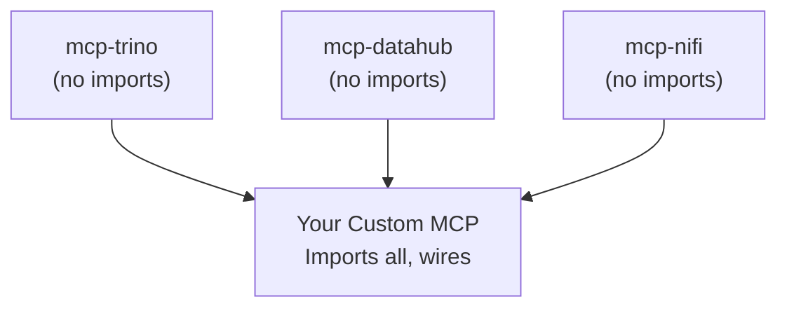

# Composability

mcp-datahub is designed for composition with other MCP tool libraries.

## Island Architecture

Each txn2 library (mcp-trino, mcp-datahub, mcp-nifi, mcp-s3) is an **island**:

- No knowledge of each other
- No shared dependencies
- Can be used independently or together



## Basic Composition

```go
package main

import (
    "github.com/modelcontextprotocol/go-sdk/mcp"

    datahubclient "github.com/txn2/mcp-datahub/pkg/client"
    datahubtools "github.com/txn2/mcp-datahub/pkg/tools"

    trinoclient "github.com/txn2/mcp-trino/pkg/client"
    trinotools "github.com/txn2/mcp-trino/pkg/tools"
)

func main() {
    server := mcp.NewServer(&mcp.Implementation{
        Name:    "unified-data-server",
        Version: "1.0.0",
    }, nil)

    // DataHub tools
    datahub, _ := datahubclient.NewFromEnv()
    datahubtools.NewToolkit(datahub).RegisterAll(server)

    // Trino tools
    trino, _ := trinoclient.NewFromEnv()
    trinotools.NewToolkit(trino).RegisterAll(server)

    // Run combined server
    server.Run(ctx, &mcp.StdioTransport{})
}
```

## Adding Middleware

Add cross-cutting concerns like logging or access control:

```go
// Create toolkit with middleware
toolkit := tools.NewToolkit(datahubClient,
    tools.WithMiddleware(loggingMiddleware),
    tools.WithMiddleware(accessControlMiddleware),
)

// Logging middleware
func loggingMiddleware(next tools.Handler) tools.Handler {
    return func(ctx context.Context, req *mcp.CallToolRequest) (*mcp.CallToolResult, error) {
        log.Printf("Tool called: %s", req.Name)
        return next(ctx, req)
    }
}
```

## Per-Tool Middleware

Apply middleware to specific tools:

```go
toolkit := tools.NewToolkit(datahubClient,
    tools.WithToolMiddleware(tools.ToolSearch, rateLimiter),
    tools.WithToolMiddleware(tools.ToolGetLineage, cacheMiddleware),
)
```

## Selective Registration

Register only the tools you need:

```go
// DataHub: only search and entity tools
datahubToolkit.Register(server,
    tools.ToolSearch,
    tools.ToolGetEntity,
)

// Trino: only query tool
trinoToolkit.Register(server,
    trinotools.ToolQuery,
)
```

## Bidirectional Integration

The library supports bidirectional context injection between toolkits. While mcp-trino can pull semantic context from DataHub, mcp-datahub can receive query execution context back from a query engine through the `QueryProvider` interface.

### QueryProvider Interface

```go
import "github.com/txn2/mcp-datahub/pkg/integration"

// QueryProvider enables query engines to inject context
type QueryProvider interface {
    Name() string
    ResolveTable(ctx context.Context, urn string) (*TableIdentifier, error)
    GetTableAvailability(ctx context.Context, urn string) (*TableAvailability, error)
    GetQueryExamples(ctx context.Context, urn string) ([]QueryExample, error)
    GetExecutionContext(ctx context.Context, urns []string) (*ExecutionContext, error)
    Close() error
}
```

### Implementation Example

```go
type trinoQueryProvider struct {
    client *trino.Client
    env    string
}

func (p *trinoQueryProvider) Name() string { return "trino" }

func (p *trinoQueryProvider) ResolveTable(ctx context.Context, urn string) (*integration.TableIdentifier, error) {
    // Parse URN: urn:li:dataset:(urn:li:dataPlatform:trino,catalog.schema.table,PROD)
    parts := parseDataHubURN(urn)
    return &integration.TableIdentifier{
        Catalog: parts.Catalog,
        Schema:  parts.Schema,
        Table:   parts.Table,
    }, nil
}

func (p *trinoQueryProvider) GetTableAvailability(ctx context.Context, urn string) (*integration.TableAvailability, error) {
    table, _ := p.ResolveTable(ctx, urn)
    // Check if table exists in Trino
    exists, err := p.client.TableExists(ctx, table.String())
    return &integration.TableAvailability{
        Available: exists,
        Table:     table,
    }, err
}

func (p *trinoQueryProvider) GetQueryExamples(ctx context.Context, urn string) ([]integration.QueryExample, error) {
    table, _ := p.ResolveTable(ctx, urn)
    return []integration.QueryExample{
        {
            Name:     "sample",
            SQL:      fmt.Sprintf("SELECT * FROM %s LIMIT 10", table.String()),
            Category: "sample",
        },
        {
            Name:     "count",
            SQL:      fmt.Sprintf("SELECT COUNT(*) FROM %s", table.String()),
            Category: "aggregation",
        },
    }, nil
}

func (p *trinoQueryProvider) GetExecutionContext(ctx context.Context, urns []string) (*integration.ExecutionContext, error) {
    tables := make(map[string]*integration.TableIdentifier)
    for _, urn := range urns {
        if table, err := p.ResolveTable(ctx, urn); err == nil {
            tables[urn] = table
        }
    }
    return &integration.ExecutionContext{
        Tables: tables,
        Source: "trino",
    }, nil
}

func (p *trinoQueryProvider) Close() error { return nil }
```

### Wiring It Up

```go
// Create provider
queryProvider := &trinoQueryProvider{client: trinoClient, env: "PROD"}

// Create toolkit with provider
toolkit := datahubtools.NewToolkit(datahubClient, config,
    datahubtools.WithQueryProvider(queryProvider),
)
```

### Enriched Tool Responses

When a QueryProvider is configured, tool responses are automatically enriched:

| Tool | Enrichment |
|------|------------|
| `datahub_search` | `query_context` with table availability for each result |
| `datahub_get_entity` | `query_table`, `query_examples`, `query_availability` |
| `datahub_get_schema` | `query_table` for immediate SQL usage |
| `datahub_get_lineage` | `execution_context` mapping URNs to queryable tables |

## Integration Interfaces

The library provides enterprise integration hooks through the `integration` package:

### Access Control

```go
import "github.com/txn2/mcp-datahub/pkg/integration"

type myAccessFilter struct {
    authService AuthService
}

func (f *myAccessFilter) CanAccess(ctx context.Context, urn string) (bool, error) {
    userID := ctx.Value("user_id").(string)
    return f.authService.CheckPermission(userID, urn, "read")
}

func (f *myAccessFilter) FilterURNs(ctx context.Context, urns []string) ([]string, error) {
    userID := ctx.Value("user_id").(string)
    return f.authService.FilterAllowed(userID, urns)
}

// Use it
toolkit := datahubtools.NewToolkit(client, config,
    datahubtools.WithAccessFilter(&myAccessFilter{authService}),
)
```

### Audit Logging

```go
type myAuditLogger struct {
    db *sql.DB
}

func (l *myAuditLogger) LogToolCall(ctx context.Context, tool string, params map[string]any, userID string) error {
    _, err := l.db.ExecContext(ctx,
        "INSERT INTO audit_log (tool, params, user_id, timestamp) VALUES (?, ?, ?, NOW())",
        tool, params, userID,
    )
    return err
}

// Use it
toolkit := datahubtools.NewToolkit(client, config,
    datahubtools.WithAuditLogger(&myAuditLogger{db}, func(ctx context.Context) string {
        return ctx.Value("user_id").(string)
    }),
)
```

### URN Resolution

Map external IDs to DataHub URNs:

```go
type myURNResolver struct {
    mappingDB *sql.DB
}

func (r *myURNResolver) ResolveToDataHubURN(ctx context.Context, externalID string) (string, error) {
    var urn string
    err := r.mappingDB.QueryRowContext(ctx,
        "SELECT datahub_urn FROM id_mapping WHERE external_id = ?",
        externalID,
    ).Scan(&urn)
    return urn, err
}

// Use it - allows tools to accept external IDs instead of URNs
toolkit := datahubtools.NewToolkit(client, config,
    datahubtools.WithURNResolver(&myURNResolver{mappingDB}),
)
```

### Metadata Enrichment

Add custom metadata to entity responses:

```go
type myEnricher struct {
    metadataService MetadataService
}

func (e *myEnricher) EnrichEntity(ctx context.Context, urn string, data map[string]any) (map[string]any, error) {
    // Add custom metadata
    custom, _ := e.metadataService.GetCustomMetadata(urn)
    data["custom_metadata"] = custom
    data["last_accessed"] = e.metadataService.GetLastAccess(urn)
    return data, nil
}

// Use it
toolkit := datahubtools.NewToolkit(client, config,
    datahubtools.WithMetadataEnricher(&myEnricher{metadataService}),
)
```

### Combining All Integration Options

```go
toolkit := datahubtools.NewToolkit(datahubClient, config,
    // Bidirectional query context
    datahubtools.WithQueryProvider(&trinoQueryProvider{trinoClient, "PROD"}),

    // Enterprise integrations
    datahubtools.WithURNResolver(&myURNResolver{}),
    datahubtools.WithAccessFilter(&myAccessFilter{}),
    datahubtools.WithAuditLogger(&myAuditLogger{}, getUserID),
    datahubtools.WithMetadataEnricher(&myEnricher{}),

    // Standard middleware
    datahubtools.WithMiddleware(loggingMiddleware),
)
```

## Adding Custom Tools

Extend with your own domain-specific tools:

```go
// Register DataHub tools
datahubtools.NewToolkit(datahub).RegisterAll(server)

// Add your custom tools
mcp.AddTool(server, &mcp.Tool{
    Name:        "company_data_dictionary",
    Description: "Get company-specific data dictionary",
}, yourHandler)
```

## Error Handling in Middleware

### Failing Fast vs Graceful Degradation

Choose the appropriate error handling strategy for your middleware:

**Fail Fast**: Return error immediately, abort tool execution

```go
func (m *StrictAuthMiddleware) Before(ctx context.Context, tc *tools.ToolContext) (context.Context, error) {
    token := ctx.Value("auth_token")
    if token == nil {
        // Fail fast: no token means abort
        return ctx, errors.New("unauthorized: missing token")
    }
    return ctx, nil
}
```

**Graceful Degradation**: Log issue but continue execution

```go
func (m *OptionalEnricherMiddleware) After(ctx context.Context, tc *tools.ToolContext, result *mcp.CallToolResult, err error) (*mcp.CallToolResult, error) {
    enriched, enrichErr := m.enricher.Enrich(ctx, result)
    if enrichErr != nil {
        // Log but don't fail - enrichment is optional
        log.Printf("Warning: enrichment failed: %v", enrichErr)
        return result, err // Return original result
    }
    return enriched, err
}
```

### Error Wrapping Pattern

Wrap errors with context for better debugging:

```go
func (m *MyMiddleware) Before(ctx context.Context, tc *tools.ToolContext) (context.Context, error) {
    result, err := m.doSomething(ctx)
    if err != nil {
        return ctx, fmt.Errorf("middleware %s failed for tool %s: %w", m.name, tc.Name, err)
    }
    return ctx, nil
}
```

### Recovery Middleware

Add recovery middleware at the start of the chain to catch panics:

```go
type RecoveryMiddleware struct{}

func (m *RecoveryMiddleware) Before(ctx context.Context, tc *tools.ToolContext) (context.Context, error) {
    return ctx, nil
}

func (m *RecoveryMiddleware) After(ctx context.Context, tc *tools.ToolContext, result *mcp.CallToolResult, err error) (*mcp.CallToolResult, error) {
    // Recovery happens here if panic occurred
    return result, err
}

// Register first so it wraps everything
toolkit := tools.NewToolkit(client,
    tools.WithMiddleware(&RecoveryMiddleware{}),
    tools.WithMiddleware(&AuthMiddleware{}),
    // ... other middleware
)
```

## Testing Middleware

### Unit Testing

Test middleware in isolation:

```go
func TestAuthMiddleware_ValidToken(t *testing.T) {
    middleware := &AuthMiddleware{secret: "test-secret"}
    ctx := context.WithValue(context.Background(), "auth_token", validToken)
    tc := &tools.ToolContext{Name: "datahub_search"}

    newCtx, err := middleware.Before(ctx, tc)

    if err != nil {
        t.Errorf("Expected no error, got: %v", err)
    }
    if newCtx.Value("user_id") == nil {
        t.Error("Expected user_id in context")
    }
}

func TestAuthMiddleware_MissingToken(t *testing.T) {
    middleware := &AuthMiddleware{secret: "test-secret"}
    ctx := context.Background()
    tc := &tools.ToolContext{Name: "datahub_search"}

    _, err := middleware.Before(ctx, tc)

    if err == nil {
        t.Error("Expected error for missing token")
    }
}
```

### Testing Middleware Chain

Test multiple middleware together:

```go
func TestMiddlewareChain(t *testing.T) {
    var executionOrder []string

    middleware1 := tools.BeforeFunc(func(ctx context.Context, tc *tools.ToolContext) (context.Context, error) {
        executionOrder = append(executionOrder, "m1-before")
        return ctx, nil
    })

    middleware2 := tools.BeforeFunc(func(ctx context.Context, tc *tools.ToolContext) (context.Context, error) {
        executionOrder = append(executionOrder, "m2-before")
        return ctx, nil
    })

    toolkit := tools.NewToolkit(mockClient,
        tools.WithMiddleware(middleware1),
        tools.WithMiddleware(middleware2),
    )

    // Execute tool...

    expected := []string{"m1-before", "m2-before"}
    if !reflect.DeepEqual(executionOrder, expected) {
        t.Errorf("Expected %v, got %v", expected, executionOrder)
    }
}
```

### Integration Testing with Mock Providers

Test with mock implementations:

```go
type MockQueryProvider struct {
    ResolveTableFunc func(ctx context.Context, urn string) (*integration.TableIdentifier, error)
}

func (m *MockQueryProvider) Name() string { return "mock" }

func (m *MockQueryProvider) ResolveTable(ctx context.Context, urn string) (*integration.TableIdentifier, error) {
    if m.ResolveTableFunc != nil {
        return m.ResolveTableFunc(ctx, urn)
    }
    return nil, nil
}

// Use in tests
func TestWithQueryProvider(t *testing.T) {
    mockProvider := &MockQueryProvider{
        ResolveTableFunc: func(ctx context.Context, urn string) (*integration.TableIdentifier, error) {
            return &integration.TableIdentifier{
                Catalog: "test",
                Schema:  "schema",
                Table:   "table",
            }, nil
        },
    }

    toolkit := tools.NewToolkit(mockClient,
        tools.WithQueryProvider(mockProvider),
    )

    // Test tool execution...
}
```

## Context Propagation

Pass data between middleware using context:

```go
// Set in one middleware
func (m *AuthMiddleware) Before(ctx context.Context, tc *tools.ToolContext) (context.Context, error) {
    ctx = context.WithValue(ctx, "user_id", userID)
    ctx = context.WithValue(ctx, "user_roles", roles)
    ctx = context.WithValue(ctx, "request_id", uuid.New().String())
    return ctx, nil
}

// Use in another middleware
func (m *AuditMiddleware) After(ctx context.Context, tc *tools.ToolContext, result *mcp.CallToolResult, err error) (*mcp.CallToolResult, error) {
    userID := ctx.Value("user_id").(string)
    requestID := ctx.Value("request_id").(string)
    // Log with context...
    return result, err
}
```

## Middleware Best Practices

| Practice | Description |
|----------|-------------|
| Stateless | Avoid storing state in middleware structs |
| Idempotent | Multiple calls should have same effect |
| Fast | Keep Before/After hooks lightweight |
| Logged | Log errors before returning them |
| Tested | Unit test each middleware independently |
| Ordered | Document expected middleware order |

## Related Topics

- [Architecture](architecture.md): How middleware fits in the system
- [API Reference](../reference/tools-api.md): Full middleware API
- [Testing Guide](../guides/testing.md): Comprehensive testing strategies
