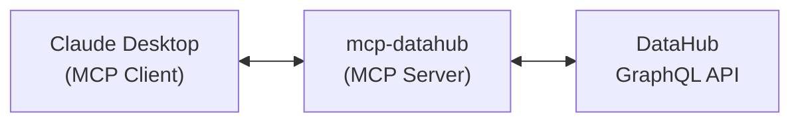

# MCP Server Overview

The mcp-datahub server provides a complete MCP implementation for DataHub, ready to use with Claude Desktop, VS Code, or any MCP-compatible client.

## Features

- **Zero Configuration**: Works out of the box with environment variables
- **All Tools Included**: Full suite of DataHub exploration tools
- **Secure**: Token-based authentication with configurable limits

## Quick Start

1. Set environment variables:

```bash
export DATAHUB_URL=https://datahub.company.com
export DATAHUB_TOKEN=your_personal_access_token
```

2. Run the server:

```bash
mcp-datahub
```

3. Configure your MCP client (e.g., Claude Desktop)

## Architecture



## Next Steps

- [Installation Guide](installation.md)
- [Configuration Options](configuration.md)
- [Available Tools](tools.md)
