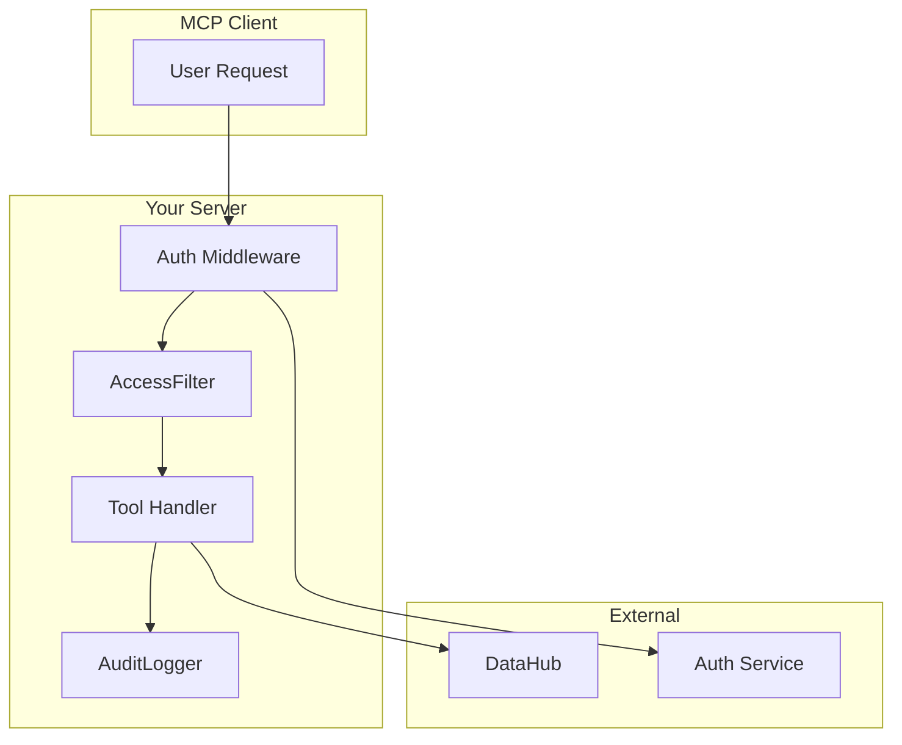
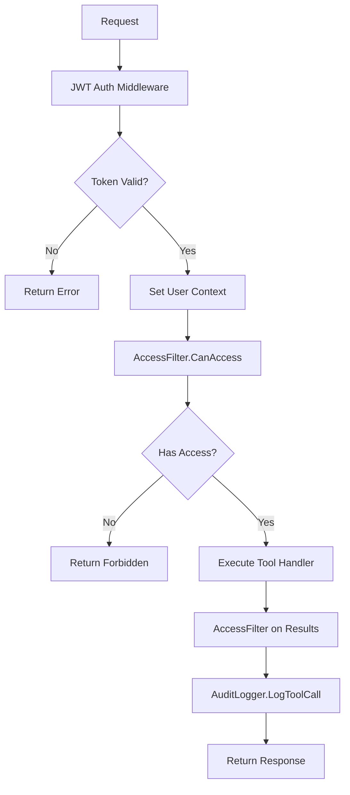

# Tutorial: Adding Authentication

Learn how to secure your custom MCP server with authentication and authorization.

**Prerequisites**:

- Completed [Building a Custom MCP Server](building-custom-server.md)
- Understanding of JWT tokens or your auth system

## What You Will Learn

- How to implement the AccessFilter interface
- How to validate JWT tokens
- How to filter results by user permissions
- How to add audit logging

## Authentication Architecture



## Step 1: Understand the Integration Interfaces

mcp-datahub provides interfaces for enterprise integration:

```go
// AccessFilter controls access to entities
type AccessFilter interface {
    CanAccess(ctx context.Context, urn string) (bool, error)
    FilterURNs(ctx context.Context, urns []string) ([]string, error)
}

// AuditLogger logs tool invocations
type AuditLogger interface {
    LogToolCall(ctx context.Context, tool string, params map[string]any, userID string) error
}
```

## Step 2: Implement AccessFilter

Create a simple role-based access filter:

```go
package main

import (
    "context"
    "strings"
)

type roleBasedAccessFilter struct {
    // Map of domain to required roles
    domainRoles map[string][]string
}

func newRoleBasedAccessFilter() *roleBasedAccessFilter {
    return &roleBasedAccessFilter{
        domainRoles: map[string][]string{
            "sales":     {"sales-team", "analytics", "admin"},
            "finance":   {"finance-team", "admin"},
            "marketing": {"marketing-team", "analytics", "admin"},
        },
    }
}

func (f *roleBasedAccessFilter) CanAccess(ctx context.Context, urn string) (bool, error) {
    // Get user roles from context (set by auth middleware)
    roles, ok := ctx.Value("user_roles").([]string)
    if !ok {
        return false, nil
    }

    // Extract domain from URN (simplified)
    domain := extractDomainFromURN(urn)
    if domain == "" {
        // No domain restriction
        return true, nil
    }

    // Check if user has required role
    requiredRoles := f.domainRoles[domain]
    for _, required := range requiredRoles {
        for _, userRole := range roles {
            if userRole == required {
                return true, nil
            }
        }
    }

    return false, nil
}

func (f *roleBasedAccessFilter) FilterURNs(ctx context.Context, urns []string) ([]string, error) {
    var allowed []string
    for _, urn := range urns {
        ok, err := f.CanAccess(ctx, urn)
        if err != nil {
            return nil, err
        }
        if ok {
            allowed = append(allowed, urn)
        }
    }
    return allowed, nil
}

func extractDomainFromURN(urn string) string {
    // Simplified domain extraction
    // Real implementation would query DataHub for entity domain
    if strings.Contains(urn, "sales") {
        return "sales"
    }
    if strings.Contains(urn, "finance") {
        return "finance"
    }
    return ""
}
```

## Step 3: Implement AuditLogger

Create an audit logger for compliance:

```go
package main

import (
    "context"
    "encoding/json"
    "log"
    "time"
)

type fileAuditLogger struct {
    logFile string
}

func newFileAuditLogger(path string) *fileAuditLogger {
    return &fileAuditLogger{logFile: path}
}

func (l *fileAuditLogger) LogToolCall(
    ctx context.Context,
    tool string,
    params map[string]any,
    userID string,
) error {
    entry := map[string]any{
        "timestamp": time.Now().UTC().Format(time.RFC3339),
        "tool":      tool,
        "params":    params,
        "user_id":   userID,
        "client_ip": ctx.Value("client_ip"),
    }

    data, err := json.Marshal(entry)
    if err != nil {
        return err
    }

    log.Printf("AUDIT: %s", string(data))
    return nil
}
```

## Step 4: Add JWT Authentication Middleware

Create middleware to validate JWT tokens and set user context:

```go
package main

import (
    "context"
    "errors"
    "strings"

    "github.com/golang-jwt/jwt/v5"
    "github.com/txn2/mcp-datahub/pkg/tools"
)

type jwtAuthMiddleware struct {
    secretKey []byte
}

func newJWTAuthMiddleware(secret string) *jwtAuthMiddleware {
    return &jwtAuthMiddleware{secretKey: []byte(secret)}
}

func (m *jwtAuthMiddleware) Before(ctx context.Context, tc *tools.ToolContext) (context.Context, error) {
    // Get token from context (set by transport layer)
    tokenString, ok := ctx.Value("auth_token").(string)
    if !ok || tokenString == "" {
        return ctx, errors.New("unauthorized: missing token")
    }

    // Remove "Bearer " prefix if present
    tokenString = strings.TrimPrefix(tokenString, "Bearer ")

    // Parse and validate token
    token, err := jwt.Parse(tokenString, func(token *jwt.Token) (any, error) {
        return m.secretKey, nil
    })
    if err != nil || !token.Valid {
        return ctx, errors.New("unauthorized: invalid token")
    }

    // Extract claims
    claims, ok := token.Claims.(jwt.MapClaims)
    if !ok {
        return ctx, errors.New("unauthorized: invalid claims")
    }

    // Add user info to context
    userID := claims["sub"].(string)
    roles := claims["roles"].([]any)

    var roleStrings []string
    for _, r := range roles {
        roleStrings = append(roleStrings, r.(string))
    }

    ctx = context.WithValue(ctx, "user_id", userID)
    ctx = context.WithValue(ctx, "user_roles", roleStrings)

    return ctx, nil
}

func (m *jwtAuthMiddleware) After(
    ctx context.Context,
    tc *tools.ToolContext,
    result *mcp.CallToolResult,
    err error,
) (*mcp.CallToolResult, error) {
    return result, err
}
```

## Step 5: Wire Everything Together

Combine all the components:

```go
package main

import (
    "context"
    "log"
    "os"

    "github.com/modelcontextprotocol/go-sdk/mcp"
    "github.com/txn2/mcp-datahub/pkg/client"
    "github.com/txn2/mcp-datahub/pkg/tools"
)

func main() {
    server := mcp.NewServer(&mcp.Implementation{
        Name:    "secure-data-server",
        Version: "1.0.0",
    }, nil)

    // Create DataHub client
    datahubClient, err := client.New(client.Config{
        URL:   os.Getenv("DATAHUB_URL"),
        Token: os.Getenv("DATAHUB_TOKEN"),
    })
    if err != nil {
        log.Fatalf("Failed to create client: %v", err)
    }
    defer datahubClient.Close()

    // Create integration components
    accessFilter := newRoleBasedAccessFilter()
    auditLogger := newFileAuditLogger("/var/log/mcp-audit.log")
    jwtAuth := newJWTAuthMiddleware(os.Getenv("JWT_SECRET"))

    // User ID extractor for audit logging
    getUserID := func(ctx context.Context) string {
        if id, ok := ctx.Value("user_id").(string); ok {
            return id
        }
        return "anonymous"
    }

    // Create toolkit with all integrations
    toolkit := tools.NewToolkit(datahubClient,
        tools.Config{
            DefaultLimit: 20,
            MaxLimit:     100,
        },
        // Add JWT authentication
        tools.WithMiddleware(jwtAuth),
        // Add access control
        tools.WithAccessFilter(accessFilter),
        // Add audit logging
        tools.WithAuditLogger(auditLogger, getUserID),
    )

    toolkit.RegisterAll(server)

    log.Println("Secure server starting...")
    if err := server.Run(context.Background(), &mcp.StdioTransport{}); err != nil {
        log.Fatalf("Server error: %v", err)
    }
}
```

## Step 6: Test Authentication

Create a test token:

```go
package main

import (
    "fmt"
    "time"

    "github.com/golang-jwt/jwt/v5"
)

func createTestToken(secret string) string {
    token := jwt.NewWithClaims(jwt.SigningMethodHS256, jwt.MapClaims{
        "sub":   "user123",
        "roles": []string{"sales-team", "analytics"},
        "exp":   time.Now().Add(time.Hour).Unix(),
    })

    tokenString, _ := token.SignedString([]byte(secret))
    return tokenString
}

func main() {
    token := createTestToken("your-secret-key")
    fmt.Println(token)
}
```

## Step 7: External Auth Service Integration

For production, integrate with your auth service:

```go
type externalAuthAccessFilter struct {
    authClient *authservice.Client
}

func (f *externalAuthAccessFilter) CanAccess(ctx context.Context, urn string) (bool, error) {
    userID := ctx.Value("user_id").(string)

    // Call external auth service
    resp, err := f.authClient.CheckPermission(ctx, &authservice.CheckRequest{
        UserID:   userID,
        Resource: urn,
        Action:   "read",
    })
    if err != nil {
        return false, err
    }

    return resp.Allowed, nil
}

func (f *externalAuthAccessFilter) FilterURNs(ctx context.Context, urns []string) ([]string, error) {
    userID := ctx.Value("user_id").(string)

    // Batch check permissions
    resp, err := f.authClient.FilterResources(ctx, &authservice.FilterRequest{
        UserID:    userID,
        Resources: urns,
        Action:    "read",
    })
    if err != nil {
        return nil, err
    }

    return resp.AllowedResources, nil
}
```

## Execution Flow

When a tool is called, the execution follows this order:



## What You Learned

- Implementing the AccessFilter interface
- Creating audit logging with AuditLogger
- Adding JWT authentication middleware
- Integrating with external auth services
- Understanding the execution flow

## Next Steps

- [Multi-Tenant Setup Guide](../guides/multi-tenant.md): Tenant isolation
- [Audit Logging Guide](../guides/audit-logging.md): Compliance logging
- [Security Reference](../reference/security.md): Security best practices
