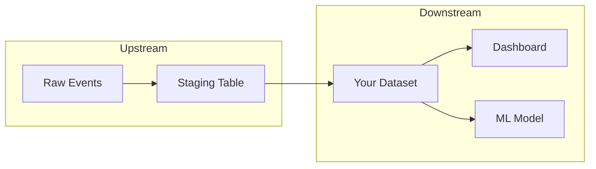

# Tutorial: Exploring Data Lineage

Learn how to trace data dependencies and understand data flow through your organization.

**Prerequisites**:

- Completed [Your First DataHub Search](first-search.md)
- DataHub instance with lineage data

## What You Will Learn

- How to trace upstream dependencies (where data comes from)
- How to discover downstream consumers (who uses this data)
- How to control lineage depth
- How to explore column-level lineage
- How to interpret lineage results

## Understanding Lineage

Data lineage shows the flow of data through your systems:



- **Upstream**: Data sources that feed into your dataset
- **Downstream**: Systems and reports that consume your dataset

## Step 1: Find a Dataset

First, find a dataset to explore. Ask:

> "Search for customer datasets in DataHub"

Pick a dataset from the results. For this tutorial, we will use:
`urn:li:dataset:(urn:li:dataPlatform:snowflake,prod.analytics.customer_metrics,PROD)`

## Step 2: Get Upstream Lineage

Discover where the data comes from. Ask:

> "What are the upstream dependencies for the customer_metrics dataset?"

The AI uses `datahub_get_lineage` with direction "UPSTREAM":

```json
{
  "urn": "urn:li:dataset:(urn:li:dataPlatform:snowflake,prod.analytics.customer_metrics,PROD)",
  "upstream": [
    {
      "urn": "urn:li:dataset:(urn:li:dataPlatform:snowflake,prod.sales.customers,PROD)",
      "name": "customers",
      "type": "DATASET",
      "platform": "snowflake"
    },
    {
      "urn": "urn:li:dataset:(urn:li:dataPlatform:snowflake,prod.sales.orders,PROD)",
      "name": "orders",
      "type": "DATASET",
      "platform": "snowflake"
    }
  ],
  "downstream": []
}
```

This tells you that `customer_metrics` is built from the `customers` and `orders` tables.

## Step 3: Get Downstream Lineage

Now discover what depends on this dataset. Ask:

> "What downstream systems use the customer_metrics dataset?"

```json
{
  "urn": "urn:li:dataset:(urn:li:dataPlatform:snowflake,prod.analytics.customer_metrics,PROD)",
  "upstream": [],
  "downstream": [
    {
      "urn": "urn:li:dashboard:(looker,customer_360)",
      "name": "Customer 360 Dashboard",
      "type": "DASHBOARD",
      "platform": "looker"
    },
    {
      "urn": "urn:li:dataset:(urn:li:dataPlatform:snowflake,prod.ml.churn_features,PROD)",
      "name": "churn_features",
      "type": "DATASET",
      "platform": "snowflake"
    }
  ]
}
```

This shows that two systems depend on `customer_metrics`: a Looker dashboard and an ML feature table.

## Step 4: Get Both Directions

To see the complete picture, request both directions. Ask:

> "Show me the full lineage for customer_metrics, both upstream and downstream"

```json
{
  "urn": "urn:li:dataset:(urn:li:dataPlatform:snowflake,prod.analytics.customer_metrics,PROD)",
  "upstream": [
    {
      "urn": "urn:li:dataset:(urn:li:dataPlatform:snowflake,prod.sales.customers,PROD)",
      "name": "customers",
      "type": "DATASET"
    },
    {
      "urn": "urn:li:dataset:(urn:li:dataPlatform:snowflake,prod.sales.orders,PROD)",
      "name": "orders",
      "type": "DATASET"
    }
  ],
  "downstream": [
    {
      "urn": "urn:li:dashboard:(looker,customer_360)",
      "name": "Customer 360 Dashboard",
      "type": "DASHBOARD"
    },
    {
      "urn": "urn:li:dataset:(urn:li:dataPlatform:snowflake,prod.ml.churn_features,PROD)",
      "name": "churn_features",
      "type": "DATASET"
    }
  ]
}
```

## Step 5: Control Lineage Depth

By default, lineage shows direct dependencies (depth 1). For deeper traversal, specify the depth. Ask:

> "Show me 3 levels of upstream lineage for customer_metrics"

With depth 3, you see the full chain:

```json
{
  "upstream": [
    {
      "urn": "urn:li:dataset:(...,customers,PROD)",
      "name": "customers",
      "level": 1,
      "upstream": [
        {
          "urn": "urn:li:dataset:(...,raw_customers,PROD)",
          "name": "raw_customers",
          "level": 2,
          "upstream": [
            {
              "urn": "urn:li:dataset:(...,customer_events,PROD)",
              "name": "customer_events",
              "level": 3
            }
          ]
        }
      ]
    }
  ]
}
```

**Understanding Depth**

- Depth 1: Direct dependencies only
- Depth 2: Dependencies of dependencies
- Depth 3+: Extended lineage chain

Higher depth means more complete lineage but slower queries. The default maximum is 5.

## Step 6: Cross-Platform Lineage

DataHub tracks lineage across platforms. Ask:

> "What upstream dependencies does the Customer 360 dashboard have?"

```json
{
  "urn": "urn:li:dashboard:(looker,customer_360)",
  "upstream": [
    {
      "urn": "urn:li:dataset:(urn:li:dataPlatform:snowflake,prod.analytics.customer_metrics,PROD)",
      "name": "customer_metrics",
      "type": "DATASET",
      "platform": "snowflake"
    },
    {
      "urn": "urn:li:dataset:(urn:li:dataPlatform:snowflake,prod.analytics.revenue_metrics,PROD)",
      "name": "revenue_metrics",
      "type": "DATASET",
      "platform": "snowflake"
    }
  ]
}
```

This shows data flowing from Snowflake tables to Looker dashboards.

## Step 7: Column-Level Lineage

For fine-grained analysis, explore how individual columns are derived. Ask:

> "Show me the column-level lineage for customer_metrics"

The AI uses `datahub_get_column_lineage`:

```json
{
  "dataset_urn": "urn:li:dataset:(urn:li:dataPlatform:snowflake,prod.analytics.customer_metrics,PROD)",
  "mappings": [
    {
      "downstream_column": "customer_id",
      "upstream_dataset": "urn:li:dataset:(urn:li:dataPlatform:snowflake,prod.sales.customers,PROD)",
      "upstream_column": "id",
      "transform": "IDENTITY"
    },
    {
      "downstream_column": "total_orders",
      "upstream_dataset": "urn:li:dataset:(urn:li:dataPlatform:snowflake,prod.sales.orders,PROD)",
      "upstream_column": "order_count",
      "transform": "AGGREGATE",
      "confidence_score": 0.95
    },
    {
      "downstream_column": "email",
      "upstream_dataset": "urn:li:dataset:(urn:li:dataPlatform:snowflake,prod.sales.customers,PROD)",
      "upstream_column": "email_address",
      "transform": "IDENTITY"
    }
  ]
}
```

**Understanding Column Lineage**

- **IDENTITY**: Column is copied directly from source
- **AGGREGATE**: Column is derived from aggregation (SUM, COUNT, etc.)
- **TRANSFORM**: Column has been transformed or computed
- **confidence_score**: Indicates how confident the lineage detection is (1.0 = certain)

Column-level lineage helps with:

- Understanding exactly how fields are derived
- Fine-grained impact analysis before column changes
- Data quality root cause analysis at column level
- Compliance and data governance audits

## Lineage Use Cases

### Impact Analysis

Before changing a table, check what depends on it:

> "What would be impacted if I change the customers table schema?"

### Root Cause Analysis

When a dashboard shows wrong data, trace back to the source:

> "Where does the Customer 360 dashboard get its data from?"

### Data Discovery

Find related datasets by exploring lineage:

> "What other datasets are derived from the same sources as customer_metrics?"

## Practice Exercises

1. Find a dataset in your catalog and trace its full lineage
2. Identify all dashboards that depend on a specific table
3. Find the original source (depth 3+) for a derived dataset
4. Discover which ML models consume data from your warehouse

## What You Learned

- Upstream lineage: tracing data sources
- Downstream lineage: finding data consumers
- Controlling lineage depth for deeper exploration
- Column-level lineage: fine-grained field derivation tracking
- Cross-platform lineage tracking
- Practical use cases for lineage analysis

## Next Steps

- [Building a Custom MCP Server](building-custom-server.md): Create your own server
- [Lineage Model Concepts](../concepts/lineage-model.md): Understand how DataHub models lineage
- [Available Tools Reference](../server/tools.md): All tool parameters
