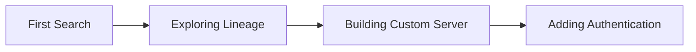

# Tutorials

Step-by-step guides to learn mcp-datahub from the ground up.

## Learning Path

These tutorials are designed to be followed in order:

## Available Tutorials

### [Your First DataHub Search](first-search.md)

Learn the basics of searching DataHub through an AI assistant. You will:

- Connect mcp-datahub to Claude Desktop
- Search for datasets by name
- Filter results by entity type
- Explore entity details

**Prerequisites**: mcp-datahub installed and configured

### [Exploring Data Lineage](exploring-lineage.md)

Understand how data flows through your organization. You will:

- Trace upstream dependencies
- Discover downstream consumers
- Visualize lineage paths
- Understand lineage depth

**Prerequisites**: Completed "Your First DataHub Search"

### [Building a Custom MCP Server](building-custom-server.md)

Create your own MCP server using the mcp-datahub library. You will:

- Set up a Go project
- Import and configure the toolkit
- Register DataHub tools
- Run your custom server

**Prerequisites**: Go 1.24+, basic Go knowledge

### [Adding Authentication](adding-authentication.md)

Secure your custom MCP server with authentication. You will:

- Implement the AccessFilter interface
- Add JWT token validation
- Filter results by user permissions
- Test authenticated access

**Prerequisites**: Completed "Building a Custom MCP Server"

## Next Steps

After completing these tutorials, explore:

- [How-to Guides](../guides/index.md) for specific tasks
- [Concepts](../concepts/index.md) for deeper understanding
- [API Reference](../reference/tools-api.md) for complete documentation
